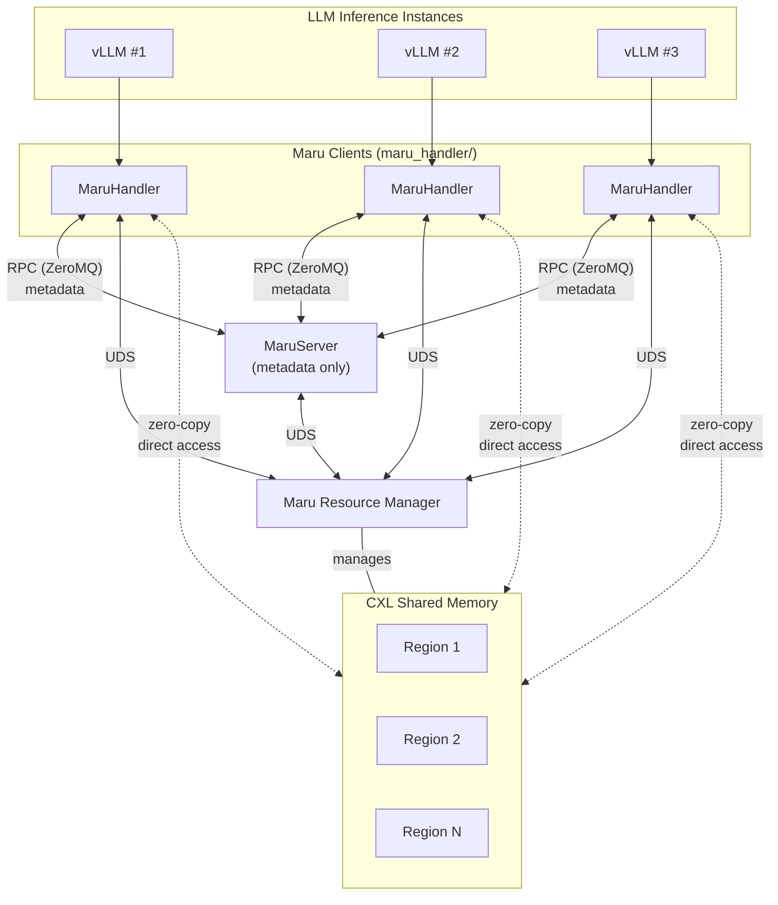

# Maru (마루)

**A High-Performance KV Cache Manager for CXL Shared Memory**

*Maru* (/mɑːruː/) — named after the central open floor in traditional Korean architecture where all rooms connect and family members freely gather and share.

## Overview

Maru enables zero-copy KV cache sharing across multiple LLM inference instances using CXL shared memory. Instead of transferring KV data over the network, instances exchange only metadata via the central `MaruServer`, then directly access KV data through memory-mapped CXL devices.

Maru can be used standalone or integrated as a storage backend for [LMCache](../LMCache-CXL/) via `CxlConnector`.

## Architecture



## Project Structure

```
maru/
├── maru_handler/                      # Client library
│   ├── handler.py                     # MaruHandler - Main client interface
│   ├── rpc_client.py                  # Synchronous RPC client (REQ-REP)
│   ├── rpc_async_client.py            # Async RPC client (DEALER-ROUTER)
│   └── memory/                        # Memory management
│       ├── types.py                   # MemoryInfo, MappedRegion types
│       ├── mapper.py                  # DaxMapper - mmap/munmap lifecycle
│       ├── allocator.py               # PagedMemoryAllocator (O(1) alloc)
│       └── owned_region_manager.py    # OwnedRegionManager - region + page mgmt
│
├── maru_server/                  # Metadata server
│   ├── server.py                      # MaruServer - Main server
│   ├── rpc_server.py                  # Synchronous ZeroMQ RPC server
│   ├── rpc_async_server.py            # Async ZeroMQ RPC server (ROUTER)
│   ├── kv_manager.py                  # KV metadata store
│   ├── allocation_manager.py          # Allocation lifecycle management
│   └── __main__.py                    # Module entry point
│
├── maru_shm/                          # Shared memory client library + types
│   ├── types.py                       # Handle, PoolInfo, DaxType
│   ├── ipc.py                         # Binary IPC protocol (resource manager <-> client)
│   ├── constants.py                   # PROT_*, MAP_*, paths, defaults
│   ├── uds_helpers.py                 # SCM_RIGHTS, SO_PEERCRED helpers
│   └── client.py                      # ShmClient: alloc, free, mmap, stats
│
├── maru_resource_manager/             # Maru Resource Manager (maru_resourced)
│   ├── CMakeLists.txt                 # Build configuration
│   ├── include/                       # Public headers (↔ maru_shm/ mirror)
│   │   ├── types.h                    # Handle, PoolInfo, DaxType
│   │   └── ipc.h                      # IPC protocol structs
│   ├── src/                           # Resource manager source files
│   │   ├── main.cpp                   # Entry point, signal handling
│   │   ├── pool_manager.{cpp,h}       # Pool discovery, first-fit allocator
│   │   ├── uds_server.{cpp,h}         # UDS server, per-client threads
│   │   ├── wal.{cpp,h}               # Write-ahead log (crash recovery)
│   │   ├── metadata.{cpp,h}          # State persistence (JSON)
│   │   ├── reaper.{cpp,h}            # Dead PID cleanup
│   │   ├── log.{cpp,h}               # Logging utilities
│   │   └── util.{cpp,h}              # Common helpers
│   ├── tools/
│   │   └── maru_test_client.cpp       # CLI test client
│   └── systemd/                       # systemd service + udev rules
│
├── maru_common/                       # Shared utilities
│   ├── protocol.py                    # Maru RPC message definitions
│   ├── serializer.py                  # MessagePack serialization
│   ├── config.py                      # MaruConfig
│   ├── logging_setup.py              # Shared logging configuration
│   └── resource_manager_installer.py # install-maru-resource-manager entry point
│
├── tests/                             # Unit + integration tests
├── docs/                              # Documentation
├── pyproject.toml
└── README.md
```

## Installation

### 1. Python packages

```bash
pip install -e .

# With dev dependencies
pip install -e ".[dev]"
```

### 2. Shared memory resource manager (maru_resourced)

```bash
# Build and install (with systemd service)
sudo $(which install-maru-resource-manager)

# Without systemd (containers, WSL, etc.)
sudo $(which install-maru-resource-manager) --no-systemd

# Clean rebuild
sudo $(which install-maru-resource-manager) --clean

# Uninstall
sudo $(which install-maru-resource-manager) --uninstall
```

## Usage

### Start the metadata server

```bash
# Default (localhost:5555)
maru-server

# Specify host and port
maru-server --host 0.0.0.0 --port 5556

# With debug logging
maru-server --log-level DEBUG
```

### Client Usage

```python
from maru import MaruConfig, MaruHandler
from maru_handler.memory import MemoryInfo

# Configuration
config = MaruConfig(
    server_url="tcp://localhost:5555",
    pool_size=1024 * 1024 * 100,  # 100MB
)

# Connect and use
with MaruHandler(config) as handler:
    # Store data (MemoryInfo wraps a memoryview)
    info = MemoryInfo(view=memoryview(b"hello world"))
    handler.store(key=12345, info=info)

    # Check if key exists
    exists = handler.exists(key=12345)

    # Retrieve data (returns MemoryInfo with zero-copy memoryview)
    result = handler.retrieve(key=12345)  # MemoryInfo | None

    # Get server stats
    stats = handler.get_stats()
```

## Test

```bash
# Unit tests
python3 -m pytest tests/ -v -m "not integration"

# Integration tests (requires running maru_resourced + ZMQ)
python3 -m pytest tests/ -v -m integration

# All tests
python3 -m pytest tests/ -v
```

## License

Apache-2.0
