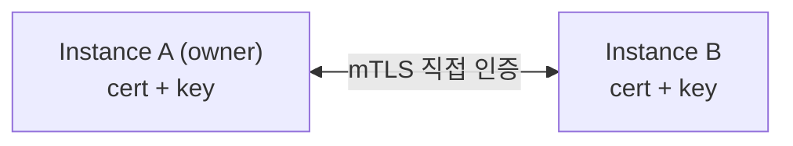
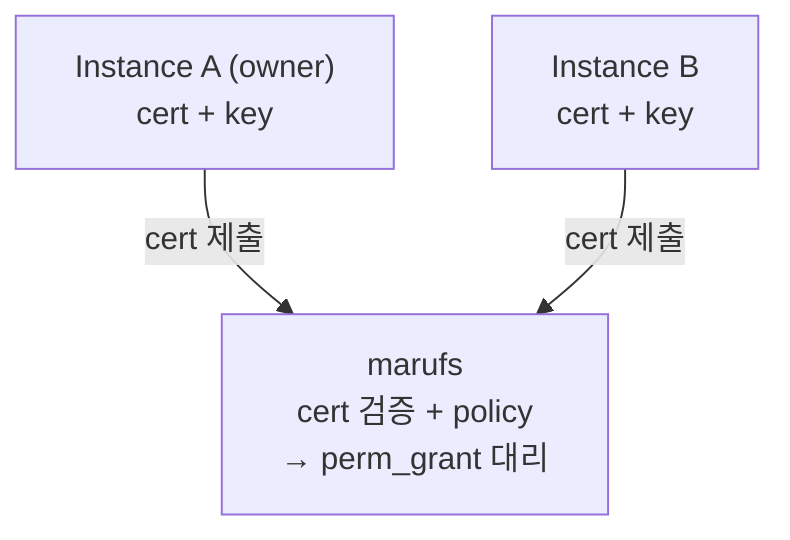
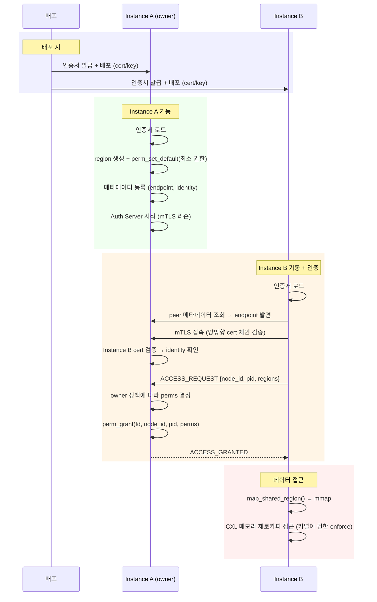
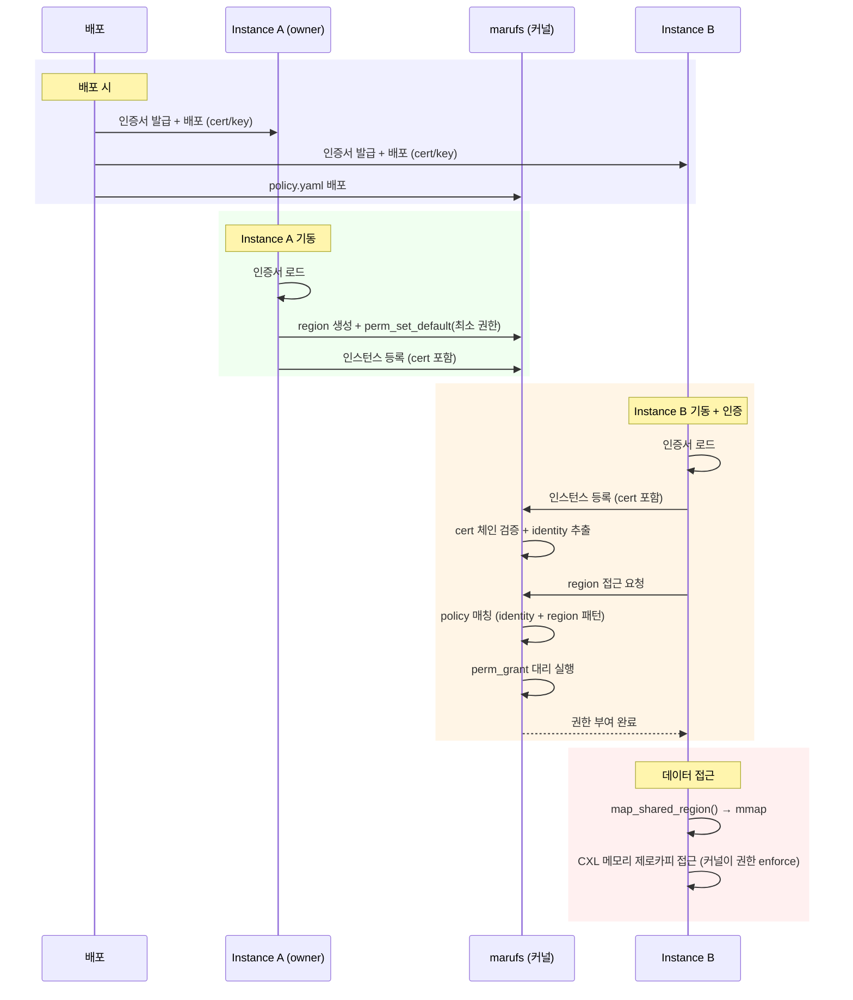

# marufs 인스턴스 인증 및 권한 부여 시스템 설계

- marufs의 KV 캐시 접근 제어는 구현 완료 — 인스턴스 간 권한 전달 메커니즘이 미해결
- Pre-provisioned X.509 인증서 기반 인증 및 권한 부여 시스템을 설계

---

## 1. 배경

### 보안 요구사항

KV 캐시에는 사용자 프롬프트와 모델 응답 상태가 포함되어 있으며, 인증 없이 공유하면 데이터 유출·캐시 오염 위험이 있다.

- **인증**: 접근 요청 인스턴스가 클러스터의 정당한 vLLM 인스턴스인지 검증
- **인가**: 인증된 인스턴스에 필요한 권한만 부여 (읽기 전용 인스턴스에 쓰기 권한 불필요)
- **최소 권한**: region 기본 권한을 최소로 설정, 인증 후 개별 grant (현재 `PERM_ALL` 개선 필요)
- **인증서 기반 identity**: X.509 인증서 기반 상호 인증 — 업계 표준 (K8s, Service Mesh, gRPC)

### Threat Model

| 위협 | 대응 |
|------|------|
| **비인증 접근** — 외부 프로세스가 KV 캐시 region 탈취 | 인증 후 개별 grant |
| **Identity 위조** — 다른 인스턴스로 위장 | X.509 체인 검증 + 커널 `(node_id, pid, birth_time)` 이중 검증 |
| **권한 상승** — 읽기 전용 인스턴스가 캐시 덮어쓰기 | 커널이 `perm_grant`된 권한만 enforce |
| **인증서 유출** — cert/key 외부 유출 | 유효기간 제한 + 폐기(CRL/OCSP) + 커널 프로세스 검증 |
| **중간자 공격** — 인증 트래픽 도청/변조 (Option A) | mTLS 암호화 채널 + 양방향 인증서 검증 |
| **프로세스 사칭** — 동일 노드에서 권한 탈취 | 커널 `pid + birth_time` 식별 + 종료 시 GC 자동 회수 |

### 범위 외 (Out of Scope)

- 인증서 발급/갱신 인프라 (기존 PKI 인프라에 위임)
- 인증서/키 파일 보호 (기존 OS 보안 메커니즘에 위임)
- CXL 하드웨어 물리적 보안

---

## 2. 개요

### 목표

- vLLM 인스턴스 간 CXL 리전 접근 시 인증 및 권한 부여
- 두 가지 인증 모델 지원:
  - **Option A (P2P)**: 인스턴스 간 직접 mTLS — owner가 자체 정책으로 권한 결정
  - **Option B (marufs-mediated)**: marufs가 대리 인증 + 사전 정의 policy에 따라 자동 권한 부여

### 아키텍처

#### Option A: P2P mTLS



#### Option B: marufs-mediated



### 신뢰 모델

| 계층 | 역할 |
|------|------|
| **인스턴스 cert** | SAN에 identity 포함. 인증 시 신원 증명. 체인 검증으로 위변조 방지 |
| **marufs 커널** | `(node_id, pid, birth_time)` 기반 프로세스 식별 + 권한 enforcement |

인증서가 프로세스의 identity를 증명하고, 커널이 접근 권한을 enforce.

### 인증 모델 비교

| | Option A: P2P | Option B: marufs-mediated |
|---|---|---|
| **인증 주체** | 각 인스턴스 (owner) | marufs (파일시스템) |
| **정책 위치** | owner 코드 내부 | marufs 설정 파일 (사전 정의) |
| **Auth Server** | owner마다 1개 | 불필요 (marufs가 대리) |
| **perm_grant 호출자** | owner 프로세스 | marufs (커널) |
| **장점** | owner가 세밀한 제어 가능 | 운영 단순, 중앙 정책 관리 |
| **단점** | 각 인스턴스에 Auth Server 구현 필요 | 정책 변경 시 marufs 설정 갱신 필요 |

---

## 3. 인증 흐름

### Option A: P2P mTLS

Instance B가 Instance A(owner)에 직접 mTLS 접속하여 인증 후 권한을 획득한다. 권한 매핑은 owner가 자체 정책에 따라 결정하며, 이 문서에서는 규정하지 않는다.



### Option B: marufs-mediated

marufs가 대리 인증자 역할을 수행. 인스턴스는 Auth Server를 구현할 필요 없이, marufs에 등록만 하면 사전 정의된 policy에 따라 커널이 자동으로 권한을 부여한다.

**사전 정의 Policy:**

```yaml
# /etc/maru/policy.yaml
policy:
  # identity → 접근 가능한 region 패턴 + 권한
  instance-a:
    - pattern: "maru_*"
      perms: [READ, WRITE, ADMIN, IOCTL]
  instance-b:
    - pattern: "maru_*"
      perms: [READ, WRITE, IOCTL]
```



**장점:**
- Auth Server 구현 불필요 — 등록만 하면 자동 권한 부여
- 정책 중앙 관리 — 클러스터 전체 일관성 보장
- owner가 offline이어도 policy 기반으로 기존 region에 권한 부여 가능

