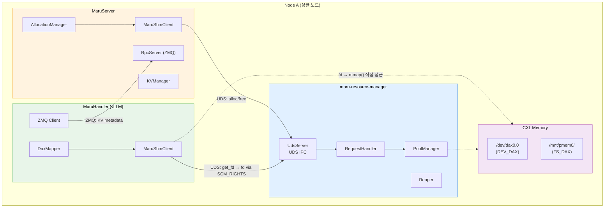
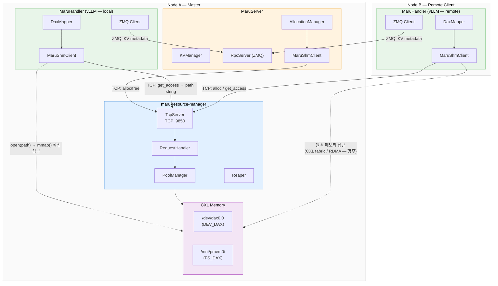

# Resource Manager: UDS → TCP 전환 설계 문서

## Before / After 요약

| 항목 | Before (UDS) | After (TCP) |
|------|-------------|-------------|
| **제어 채널** | Unix Domain Socket | TCP socket |
| **메모리 접근 정보** | FD via `SCM_RIGHTS` | 문자열 주소 (device path + offset) |
| **클라이언트 mmap** | `mmap(fd, ...)` | `open(path)` → `mmap(fd, ...)` |
| **로컬 전용** | Yes (UDS = 같은 노드만) | No (TCP = 원격 노드 가능) |
| **소유권 추적** | `SO_PEERCRED` (커널이 PID 제공) | 클라이언트가 명시적으로 전달 |
| **서버 주소** | `/tmp/maru-resourced/maru-resourced.sock` | `tcp://host:port` (기본: `tcp://0.0.0.0:9850`) |

---

## 1. 배경

### 1.1 현재 구조

```
[같은 노드]
MaruServer ──UDS──▶ maru-resource-manager
MaruHandler ──UDS──▶ maru-resource-manager
                        │
                        ▼
                   CXL/DAX device
```

모든 컴포넌트가 같은 노드에 있어야 한다. UDS는 로컬 전용이고, `SCM_RIGHTS`로 디바이스 fd를 전달하는 방식은 같은 커널을 공유하는 프로세스 간에서만 동작한다.

### 1.2 전환 목표

TCP로 제어 채널을 교체하여 원격 노드의 클라이언트가 접속할 수 있게 한다. fd 전달 대신 **문자열 주소**(device path + offset)를 반환하고, 클라이언트가 직접 open하여 mmap한다.

#### Before: 싱글 노드 (UDS)



#### After: 멀티 노드 (TCP)



**핵심 차이점:**

| | Before (UDS) | After (TCP) |
|---|---|---|
| **Transport** | UDS (`AF_UNIX`) | TCP (`AF_INET`, port 9850) |
| **메모리 접근 정보** | fd via `SCM_RIGHTS` | path 문자열 (`/dev/dax0.0`) |
| **클라이언트 mmap** | `mmap(받은_fd, ...)` | `open(path)` → `mmap(fd, ...)` |
| **원격 클라이언트** | 불가능 | TCP로 제어, 데이터 접근은 향후 CXL fabric/RDMA |
| **RequestHandler** | 변경 없음 | 변경 없음 (transport 분리 이점) |

### 1.3 비목표 (이번 스코프 외)

- 원격 노드에서의 CXL 메모리 직접 접근 (CXL fabric / RDMA) — 별도 설계 필요
- 프로토콜을 protobuf로 교체 — 메시지 타입이 적어 불필요
- Reaper의 원격 노드 heartbeat 대응

---

## 2. 핵심 변경: FD 패싱 → 문자열 주소

### 2.1 현재: `SCM_RIGHTS` FD 패싱

```
Client                          Resource Manager
  │                                   │
  │── ALLOC_REQ ──────────────────▶  │
  │                                   │ alloc from pool
  │◀─ ALLOC_RESP + fd (SCM_RIGHTS) ──│
  │                                   │
  │  mmap(fd, offset, length)         │
```

클라이언트는 서버로부터 **fd**(파일 디스크립터)를 직접 전달받아 mmap한다.

### 2.2 변경 후: 문자열 주소 반환

```
Client                          Resource Manager
  │                                   │
  │── ALLOC_REQ ──────────────────▶  │
  │                                   │ alloc from pool
  │◀─ ALLOC_RESP + AccessInfo ────── │
  │     { path: "/dev/dax0.0",       │
  │       offset: 0x200000,          │
  │       length: 0x400000 }         │
  │                                   │
  │  fd = open(path)                  │
  │  mmap(fd, offset, length)         │
```

클라이언트는 서버로부터 **경로 문자열**을 받아 직접 open → mmap한다. TCP에서도 동작하고, UDS에서도 동작한다.

### 2.3 AccessInfo 구조

| 필드 | 타입 | 설명 |
|------|------|------|
| `path` | string | 디바이스 경로 (예: `/dev/dax0.0`, `/mnt/pmem0/maru_42.dat`) |
| `offset` | uint64 | mmap 시작 오프셋 |
| `length` | uint64 | 할당 크기 |

DEV_DAX와 FS_DAX에서 다르게 동작:

| | DEV_DAX | FS_DAX |
|---|---------|--------|
| **path** | `/dev/dax0.0` (공유 디바이스) | `/mnt/pmem0/maru_42.dat` (개별 파일) |
| **offset** | 실제 바이트 오프셋 | 0 (파일 전체가 하나의 할당) |
| **length** | 정렬된 할당 크기 | 파일 크기 |

---

## 3. 와이어 프로토콜 변경

### 3.1 헤더: 변경 없음

`MsgHeader`(12 bytes)는 그대로 유지. `PROTOCOL_VERSION`을 2로 올린다.

```
magic(4) + version(2) + type(2) + payload_len(4) = 12 bytes
```

### 3.2 AllocResp: AccessInfo 필드 추가

현재 `AllocResp`는 48 bytes 고정 크기인데, 가변 길이 문자열이 필요하므로 **가변 길이 payload**로 변경한다.

```
[Before — 48 bytes 고정]
status(i32) + accessType(u32) + Handle(32) + requestedSize(u64)

[After — 가변 길이]
status(i32) + accessType(u32) + Handle(32) + requestedSize(u64)
+ pathLen(u32) + path(pathLen bytes) + pad(0-3 bytes for 4-byte alignment)
```

- `accessType=LOCAL`이면 `path`가 포함됨
- `accessType=REMOTE`이면 향후 원격 접근 정보 포함 (이번 스코프 외)
- `pathLen=0`이면 하위 호환 (구 클라이언트는 path 무시 가능)

### 3.3 GET_FD_REQ/GET_FD_RESP → GET_ACCESS_REQ/GET_ACCESS_RESP

FD를 전달하지 않으므로 이름과 역할이 변경된다:

| Before | After |
|--------|-------|
| `GET_FD_REQ` (type=9) | `GET_ACCESS_REQ` (type=9, 동일 번호) |
| `GET_FD_RESP` (type=10) | `GET_ACCESS_RESP` (type=10, 동일 번호) |

`GET_ACCESS_RESP` payload:

```
status(i32) + pathLen(u32) + path(pathLen bytes) + offset(u64) + length(u64)
```

### 3.4 기타 메시지: 변경 없음

| 메시지 | 변경 |
|--------|------|
| `ALLOC_REQ` | 변경 없음 |
| `FREE_REQ` / `FREE_RESP` | 변경 없음 |
| `STATS_REQ` / `STATS_RESP` | 변경 없음 |
| `REGISTER_SERVER_REQ` / `RESP` | PID 전달 방식 변경 (3.5 참조) |
| `UNREGISTER_SERVER_REQ` / `RESP` | 동일 |
| `ERROR_RESP` | 변경 없음 |

### 3.5 소유권 식별: `SO_PEERCRED` → 명시적 client_id

UDS에서는 `SO_PEERCRED`로 커널이 클라이언트 PID를 제공했다. TCP에서는 이 메커니즘이 없으므로, 클라이언트가 **명시적으로 식별자를 전달**한다.

**방안: `RequestContext`에 `client_id` 추가**

```
[ALLOC_REQ — 변경]
size(u64) + pool_id(u32) + client_id_len(u16) + client_id(variable)
```

`client_id`는 `"hostname:pid"` 형식의 문자열. Reaper는 이 값으로 프로세스 생존을 확인한다.
- 같은 노드: `kill(pid, 0)`으로 확인 (기존과 동일)
- 원격 노드: hostname이 다르면 Reaper가 건드리지 않음 (향후 heartbeat으로 확장)

---

## 4. C++ 서버 변경

### 4.1 TcpServer 추가

`UdsServer`와 동일한 구조로 `TcpServer`를 추가한다. `RequestHandler`는 **변경 없이 공유**.

```
[변경 후]
main.cpp
  ├── PoolManager
  ├── RequestHandler(pm)      ← 공유
  ├── TcpServer(handler)      ← 새로 추가
  └── Reaper(pm)
```

`UdsServer`는 **삭제**한다 (TCP로 완전 대체).

```cpp
// tcp_server.h
class TcpServer {
public:
    TcpServer(RequestHandler &handler, const std::string &bindAddr, uint16_t port);
    int start();
    void stop();
private:
    void acceptLoop();
    void handleClient(int clientFd);
    // TCP read/write — SCM_RIGHTS 없음, 대신 AccessInfo를 payload에 포함
    RequestHandler &handler_;
    std::string bindAddr_;
    uint16_t port_;
    // ...
};
```

### 4.2 RequestHandler 변경

`AllocResult`와 `GetFdResult`에서 fd 대신 **path 정보**를 반환하도록 변경:

```cpp
// Before
struct AllocResult {
    AllocResp resp{};
    int daxFd = -1;  // transport가 SCM_RIGHTS로 전달
};

// After
struct AllocResult {
    AllocResp resp{};
    std::string devicePath;  // transport가 payload에 포함
};

struct GetAccessResult {  // GetFdResult → GetAccessResult
    GetAccessResp resp{};
    std::string devicePath;
    uint64_t offset;
    uint64_t length;
};
```

`PoolManager`에서 할당 시 해당 풀의 디바이스 경로를 함께 반환하도록 한다. PoolManager는 이미 풀별로 디바이스 정보를 가지고 있으므로 인터페이스 추가만 필요.

### 4.3 main.cpp CLI 변경

```
[Before]
--socket-path PATH    UDS 소켓 경로

[After]
--host ADDR           TCP bind 주소 (기본: 0.0.0.0)
--port PORT           TCP 포트 (기본: 9850)
```

`--socket-path`는 제거.

### 4.4 삭제 대상

| 파일 | 이유 |
|------|------|
| `uds_server.h/cpp` | TCP로 대체 |
| `SCM_RIGHTS` 관련 코드 | fd 전달 제거 |
| `SO_PEERCRED` 관련 코드 | client_id로 대체 |

---

## 5. Python 클라이언트 변경

### 5.1 `MaruShmClient` — TCP 연결

```python
# Before
class MaruShmClient:
    def __init__(self, socket_path: str | None = None):
        self._socket_path = socket_path or DEFAULT_SOCKET_PATH

    def _connect(self) -> socket.socket:
        sock = socket.socket(socket.AF_UNIX, socket.SOCK_STREAM)
        sock.connect(self._socket_path)
        return sock

# After
class MaruShmClient:
    def __init__(self, address: str | None = None):
        self._address = address or DEFAULT_ADDRESS  # "host:port"

    def _connect(self) -> socket.socket:
        host, port = self._parse_address(self._address)
        sock = socket.socket(socket.AF_INET, socket.SOCK_STREAM)
        sock.connect((host, port))
        return sock
```

### 5.2 `alloc()` — FD 수신 → path 수신

```python
# Before
def alloc(self, size, pool_id):
    # ...
    payload, recv_fd = recv_with_fd(sock, hdr.payload_len)
    resp = AllocResp.unpack(payload)
    self._fd_cache[handle.region_id] = recv_fd
    return handle

# After
def alloc(self, size, pool_id):
    # ...
    payload = read_full(sock, hdr.payload_len)
    resp = AllocResp.unpack(payload)  # path 포함
    self._path_cache[handle.region_id] = resp.device_path
    return handle
```

### 5.3 `mmap()` — FD 캐시 → path에서 직접 open

```python
# Before
def mmap(self, handle, prot, flags):
    fd = self._fd_cache.get(handle.region_id)
    if fd is None:
        fd = self._request_fd(handle)  # GET_FD via SCM_RIGHTS
    mm = mmap.mmap(fd, handle.length, offset=handle.offset)

# After
def mmap(self, handle, prot, flags):
    path = self._path_cache.get(handle.region_id)
    if path is None:
        access = self._request_access(handle)  # GET_ACCESS_REQ
        path = access.device_path
        self._path_cache[handle.region_id] = path
    fd = os.open(path, os.O_RDWR)
    mm = mmap.mmap(fd, handle.length, offset=handle.offset)
    os.close(fd)  # mmap 이후 fd는 닫아도 됨
```

### 5.4 `uds_helpers.py` 변경

`send_with_fd()`, `recv_with_fd()` 함수는 **삭제**. TCP에서는 `read_full()`, `write_full()`만 사용.

### 5.5 상수 변경

```python
# Before
DEFAULT_SOCKET_PATH = "/tmp/maru-resourced/maru-resourced.sock"

# After
DEFAULT_ADDRESS = "127.0.0.1:9850"
```

### 5.6 `is_running()` / `_try_connect()` — TCP로 변경

```python
def _try_connect(self) -> bool:
    host, port = self._parse_address(self._address)
    sock = socket.socket(socket.AF_INET, socket.SOCK_STREAM)
    try:
        sock.connect((host, port))
        sock.close()
        return True
    except OSError:
        sock.close()
        return False
```

---

## 6. DaxMapper 변경

`DaxMapper`는 `MaruShmClient.mmap()`을 호출하는데, 내부 구현이 바뀌어도 인터페이스는 동일하므로 **변경 없음**.

```python
# DaxMapper.map_region() — 변경 없음
result = self._client.mmap(handle, prot)
```

`MaruShmClient.mmap()` 내부에서 path로 open → mmap하는 것이 투명하게 처리됨.

---

## 7. IPC 메시지 Python 변경

### 7.1 `AllocResp` — path 필드 추가

```python
@dataclass
class AllocResp:
    status: int = 0
    handle: MaruHandle | None = None
    requested_size: int = 0
    device_path: str = ""  # 새 필드

    def pack(self) -> bytes:
        h = self.handle or MaruHandle()
        path_bytes = self.device_path.encode("utf-8")
        # 기존 고정 부분 + pathLen(u32) + path + padding
        fixed = struct.pack(
            _ALLOC_RESP_FORMAT,
            self.status, 0,
            h.region_id, h.offset, h.length, h.auth_token,
            self.requested_size,
        )
        path_header = struct.pack("=I", len(path_bytes))
        pad = b"\x00" * ((4 - len(path_bytes) % 4) % 4)
        return fixed + path_header + path_bytes + pad

    @classmethod
    def unpack(cls, data: bytes) -> "AllocResp":
        # 기존 고정 부분 파싱
        vals = struct.unpack(_ALLOC_RESP_FORMAT, data[:_ALLOC_RESP_SIZE])
        # ...
        # path 파싱 (있으면)
        device_path = ""
        offset = _ALLOC_RESP_SIZE
        if offset + 4 <= len(data):
            (path_len,) = struct.unpack("=I", data[offset:offset+4])
            offset += 4
            device_path = data[offset:offset+path_len].decode("utf-8")
        return cls(status=status, handle=handle,
                   requested_size=requested_size, device_path=device_path)
```

### 7.2 `GetAccessResp` (기존 `GetFdResp` 대체)

```python
@dataclass
class GetAccessResp:
    status: int = 0
    device_path: str = ""
    offset: int = 0
    length: int = 0
```

---

## 8. 파일별 변경 사항

```
변경:
  maru_resource_manager/src/main.cpp            ← --host/--port CLI, TcpServer 사용
  maru_resource_manager/src/request_handler.h   ← AllocResult.devicePath, GetAccessResult
  maru_resource_manager/src/request_handler.cpp ← path 반환 로직
  maru_resource_manager/include/ipc.h           ← AllocResp path 필드, GET_ACCESS, client_id
  maru_resource_manager/CMakeLists.txt          ← tcp_server.cpp 추가, uds_server.cpp 제거

  maru_shm/client.py         ← TCP 연결, path 기반 mmap, fd 캐시 → path 캐시
  maru_shm/ipc.py            ← AllocResp.device_path, GetAccessResp
  maru_shm/uds_helpers.py    ← send_with_fd/recv_with_fd 삭제
  maru_shm/constants.py      ← DEFAULT_ADDRESS = "127.0.0.1:9850"
  maru_shm/types.py          ← 변경 없음 (MaruHandle, MaruPoolInfo 유지)

  maru_handler/memory/mapper.py  ← 변경 없음 (MaruShmClient.mmap() 인터페이스 동일)

신규:
  maru_resource_manager/src/tcp_server.h/cpp    ← TCP transport

삭제:
  maru_resource_manager/src/uds_server.h/cpp    ← UDS transport 제거
```

---

## 9. 구현 순서

### Phase 1: 프로토콜 확장 (하위 호환)

1. C++ `ipc.h` — `AllocResp`에 path 필드 추가, `GetAccessResp` 정의
2. C++ `request_handler` — `AllocResult.devicePath` 반환, `handleGetAccess()` 추가
3. Python `ipc.py` — `AllocResp.device_path`, `GetAccessResp` 추가
4. Python `client.py` — `alloc()`에서 path 파싱, `_request_access()` 추가
5. Python `client.py` — `mmap()`에서 path 기반 open 로직 추가 (fd 캐시와 병행)

**이 Phase 완료 후**: UDS 위에서 path 기반 mmap이 동작. fd 패싱은 아직 유지 (하위 호환).

### Phase 2: TCP transport 추가

6. C++ `tcp_server.h/cpp` — TCP accept/read/write, AccessInfo를 payload에 포함
7. C++ `main.cpp` — `--host`/`--port` CLI, `TcpServer` 사용
8. Python `client.py` — `_connect()`를 TCP로 변경
9. Python `constants.py` — `DEFAULT_ADDRESS`
10. Python `client.py` — `is_running()` TCP 버전

**이 Phase 완료 후**: TCP 위에서 전체 동작 확인.

### Phase 3: UDS 제거

11. C++ `uds_server.h/cpp` 삭제
12. Python `uds_helpers.py`에서 `send_with_fd()`, `recv_with_fd()` 삭제
13. Python `client.py`에서 fd 캐시, `_request_fd()` 삭제
14. C++ `ipc.h`에서 `SO_PEERCRED` 관련 제거
15. 테스트 업데이트

**이 Phase 완료 후**: UDS 코드 완전 제거, TCP only.

---

## 10. 보안 고려사항

### 10.1 디바이스 접근 권한

현재: 서버가 fd를 전달하므로, 클라이언트에게 디바이스 읽기/쓰기 권한이 없어도 됨.

변경 후: 클라이언트가 직접 `open(path)`하므로, **클라이언트 프로세스에 디바이스 접근 권한이 필요**함.

```bash
# DEV_DAX 디바이스 권한 설정
sudo chmod 666 /dev/dax0.0
# 또는 그룹 기반
sudo chgrp maru /dev/dax0.0 && sudo chmod 660 /dev/dax0.0
```

이는 보안 약화이지만, 멀티 노드 환경에서 fd 패싱이 불가능하므로 불가피한 트레이드오프.
auth_token 검증은 유지되므로, 유효한 할당 없이 임의 영역을 mmap하는 것은 불가능 (resource manager가 offset/length를 검증).

### 10.2 client_id 신뢰성

TCP에서 `client_id`는 클라이언트가 자체 보고하므로 위조 가능. 현재 스코프에서는 신뢰 환경(internal cluster)을 가정하고, 향후 mTLS나 토큰 기반 인증 추가를 검토.

---

## 11. 마이그레이션 가이드

### 서버 시작

```bash
# Before
maru-resource-manager --socket-path /tmp/maru-resourced/maru-resourced.sock

# After
maru-resource-manager --host 0.0.0.0 --port 9850
```

### Python 클라이언트

```python
# Before
client = MaruShmClient(socket_path="/tmp/maru-resourced/maru-resourced.sock")

# After
client = MaruShmClient(address="192.168.1.100:9850")
```

### MaruServer (AllocationManager)

```python
# Before
self._client = MaruShmClient()  # 로컬 UDS

# After
self._client = MaruShmClient()  # 로컬 TCP (기본: 127.0.0.1:9850)
```

### MaruHandler (DaxMapper) — 원격 노드

```python
# Before — 불가능 (UDS는 로컬 전용)

# After
mapper = DaxMapper(rm_address="192.168.1.100:9850")
# DaxMapper가 MaruShmClient(address=rm_address) 생성
```

---

## 12. RM 주소 전달: 누가 어떻게 아는가

TCP로 전환하면 Resource Manager가 어느 노드에 있는지 클라이언트가 알아야 한다. UDS 시절에는 모두 같은 노드였으므로 기본 소켓 경로만으로 충분했지만, 멀티 노드에서는 **명시적으로 주소를 전달**해야 한다.

### 12.1 전달 경로

```
사용자 CLI 인자
    │
    ├──▶ maru-resource-manager --host 0.0.0.0 --port 9850
    │        (RM이 어디서 listen하는지)
    │
    ├──▶ maru-server --port 5555 --rm-address 192.168.1.100:9850
    │        (MaruServer가 RM에 접속)
    │        AllocationManager → MaruShmClient(address="192.168.1.100:9850")
    │
    └──▶ MaruHandler (vLLM config)
             maru_path: "maru://192.168.1.100:5555"      ← MaruServer 주소 (기존)
             maru_rm_address: "192.168.1.100:9850"        ← RM 주소 (신규)
             DaxMapper → MaruShmClient(address="192.168.1.100:9850")
```

### 12.2 컴포넌트별 변경

| 컴포넌트 | 현재 | 변경 |
|----------|------|------|
| **maru-resource-manager** | `--socket-path` | `--host` + `--port` |
| **MaruServer CLI** | RM 주소 불필요 (같은 노드 UDS) | `--rm-address HOST:PORT` 추가 (기본: `127.0.0.1:9850`) |
| **AllocationManager** | `MaruShmClient()` | `MaruShmClient(address=config.rm_address)` |
| **MaruHandler config** | RM 주소 불필요 | `maru_rm_address` 필드 추가 (기본: `127.0.0.1:9850`) |
| **DaxMapper** | `MaruShmClient()` | `MaruShmClient(address=rm_address)` — 생성자에 주소 전달 |
| **LMCache config** | `maru_path` only | `maru_rm_address` 추가 (MaruHandler에 전달) |

### 12.3 구현 상세

#### MaruServer CLI

```python
# maru_server/server.py
parser.add_argument("--rm-address", default="127.0.0.1:9850",
                    help="Resource manager address (host:port)")
```

#### AllocationManager

```python
class AllocationManager:
    def __init__(self, rm_address: str = "127.0.0.1:9850"):
        self._client = MaruShmClient(address=rm_address)
        self._client.register_server()
```

#### DaxMapper

```python
class DaxMapper:
    def __init__(self, rm_address: str = "127.0.0.1:9850"):
        self._client = MaruShmClient(address=rm_address)
```

#### MaruHandler config (LMCache 측)

```python
# lmcache config에 추가
maru_rm_address: Optional[str] = "127.0.0.1:9850"
```

### 12.4 기본값과 시작 순서

모든 컴포넌트의 RM 주소 기본값이 `127.0.0.1:9850`이므로, 싱글 노드에서는 `--rm-address` 인자를 생략할 수 있다. 단, **Resource Manager는 항상 사용자가 먼저 수동으로 시작**해야 한다. 자동 감지/자동 시작은 없음.

```bash
# 싱글 노드 — --rm-address 생략 가능 (기본값 127.0.0.1:9850 동일)
maru-resource-manager                  # 1) 먼저 실행 (0.0.0.0:9850)
maru-server --port 5555                # 2) 이후 실행 (기본: rm-address=127.0.0.1:9850)

# RM이 안 떠있으면 MaruServer 시작 시 ConnectionError 발생

# 멀티 노드 — RM 주소 명시 필요
# Node A (master)
maru-resource-manager --host 0.0.0.0 --port 9850
maru-server --port 5555 --rm-address 192.168.1.100:9850

# Node B (remote client)
# vLLM config: maru_path="maru://192.168.1.100:5555", maru_rm_address="192.168.1.100:9850"
```
