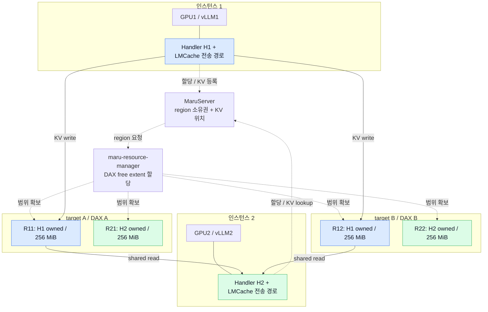
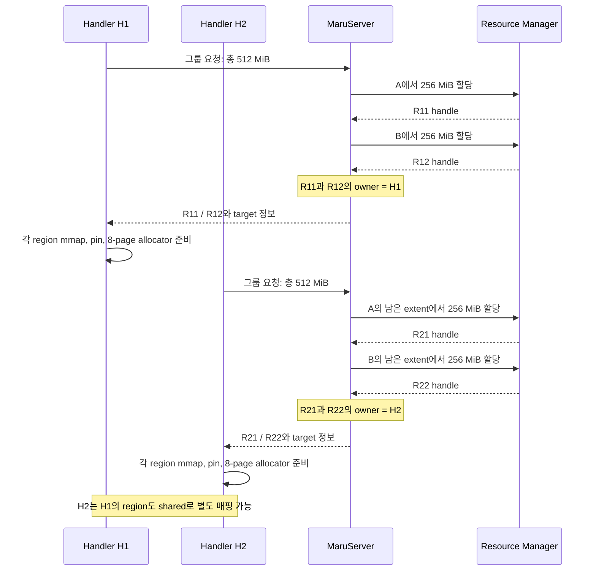
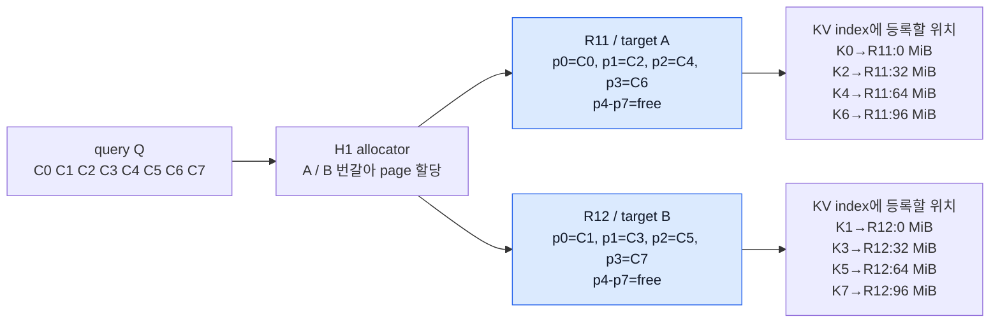
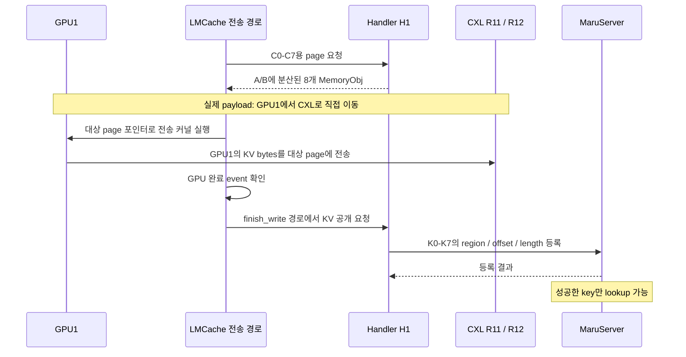
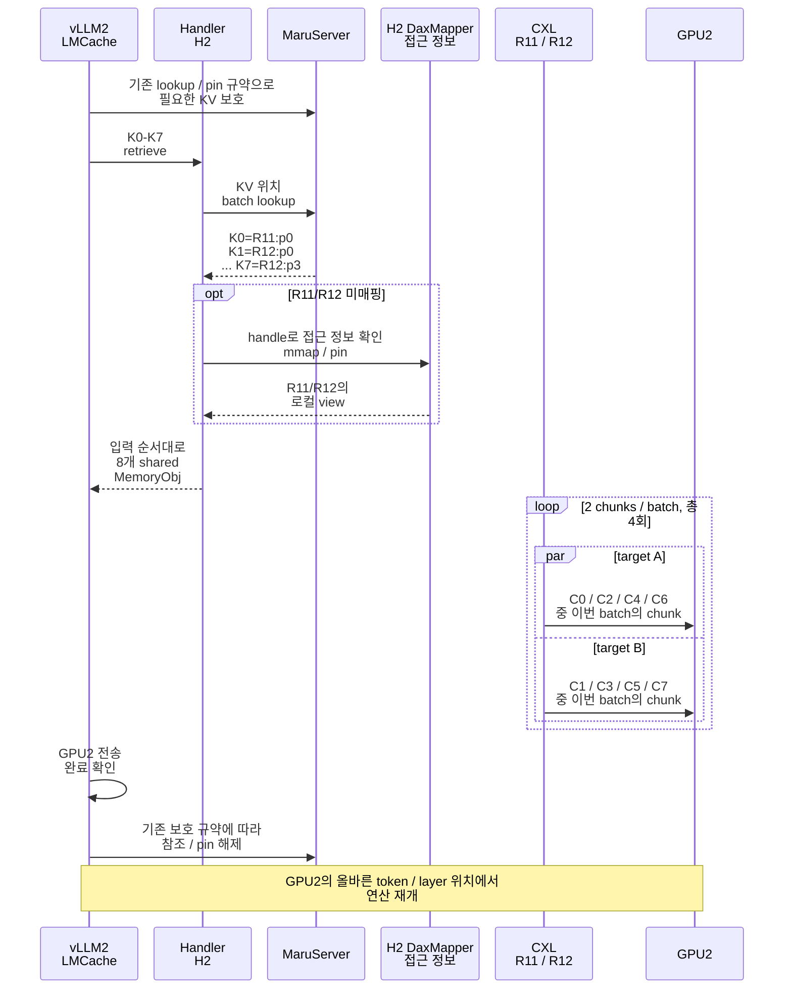
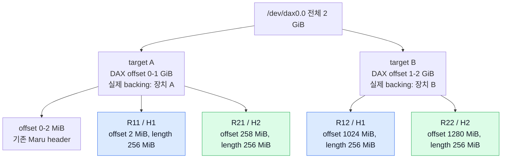

# Maru 다중 CXL 장치의 chunk 분산 할당과 병렬 전송

**필수 호환성 조건:** interleaving 설정을 명시적으로 켜지 않으면 기존 동작을 유지한다. 옵션 생략과 명시적 OFF는 동일하게 처리하며, 후속 커밋도 기존 할당·확장·전송·KV 접근 경로를 변경하지 않는다. 이 조건을 깨는 변경은 회귀 테스트로 차단한다.

## 현재 설정과 사용법 — C01–C03 / Experimental

**이 기능은 experimental이며 기본값은 OFF다. C01 설정, C02 region 준비·정리, C03 별도 DAX 그룹 할당 RPC가 구현됐다. 서버의 ON 그룹 endpoint는 사용할 수 있지만 Handler ON 연결·chunk 분산은 C04 전까지 차단되고, LMCache 연결과 병렬 read 실험은 C05·C06 대상이다.** 아래 본문의 다중 Handler 흐름과 ON YAML 예시는 후속 구현 목표다.

### 추가된 설정 한눈에 보기

| 위치 | 설정 | 기본값 | 현재 의미 |
|---|---|---|---|
| MaruServer CLI | `--allocation-policy` | `fill_first` | OFF=`fill_first`, ON=`chunk_round_robin`; C03은 별도 DAX 그룹 RPC만 지원 |
| Python `MaruServer(...)` | `allocation_policy` | `"fill_first"` | CLI와 같은 서버 정책 |
| Python `MaruConfig(...)` | `placement_policy` | `"fill_first"` | Handler 정책; ON 설정은 `auto_expand=False` 필요, Handler 생성은 아직 미지원 |
| MaruServer CLI | `--target-sizes` | 미지정 | 예: `256GiB,256GiB`. 단일 DAX의 연속 범위 크기 목록 |
| MaruServer CLI | `--target-size` + `--target-count` | 미지정 | 동일 크기 범위 반복. 예: `256GiB` × `2` |
| MaruServer CLI | `--target-base-offset` | 범위 사용 시 `0` | DAX 파일 기준 시작 offset. 바이트 또는 `MiB`/`GiB` 등 |
| Python `MaruServer(...)` | `allocation_targets` | `None` | `AllocationTarget` 목록으로 전체 DAX 또는 offset/length 범위를 명시 |

`--dax-path`, `pool_size`, `chunk_size_bytes`, `auto_expand`는 기존 설정이다. 범위 CLI에서는 `--dax-path`를 정확히 하나 지정한다. `--target-sizes`와 `--target-size + --target-count`는 함께 사용할 수 없다. 크기는 정수 바이트 또는 `B/KiB/MiB/GiB/TiB`로 입력하고, 크기 목록/반복 확장은 최대 1,024개 target까지 허용한다. 소수나 `GB` 같은 십진 단위는 받지 않는다.

**이 표는 실제 Maru CLI/Python API 기준이다. 신규 LMCache YAML 필드나 환경변수 전달은 아직 연결하지 않았다.** 본문의 설계용 YAML을 현재 설정 파일에 넣는 것으로 활성화되지 않는다.

### 기본 OFF로 기존처럼 사용

신규 옵션을 생략하면 기존 방식이다. 아래 두 서버 명령은 같은 OFF 경로를 사용한다.

```bash
# 기존 명령 그대로
maru-server --dax-path /dev/dax0.0

# OFF를 명시
maru-server --allocation-policy fill_first --dax-path /dev/dax0.0
```

클라이언트도 정책을 생략하거나 OFF를 명시하면 된다. 기존 pool 크기, chunk 크기 및 다른 설정은 사용하던 값을 그대로 전달한다.

```python
from maru import MaruConfig

config = MaruConfig()  # placement_policy="fill_first"가 기본값
explicit_off = MaruConfig(placement_policy="fill_first")
```

이미 하드웨어 interleave된 DAX에서는 이 OFF 구성을 기본으로 사용한다. 소프트웨어 정책 스위치는 하드웨어 interleave/NUMA 설정을 변경하지 않는다.

### ON 설정 형식 — 서버 그룹 RPC 지원, Handler 연결은 C04 대상

별도 DAX 두 개를 사용하는 설정 형식은 다음과 같다. **C03부터 서버를 시작해 `multi_pool_alloc_v1` 그룹 RPC를 사용할 수 있다.** 시작 시 RM의 DEV_DAX allowlist를 검증하며, 실제 region은 그룹 요청을 받을 때 할당한다. 기존 단일 region 요청을 ON 서버에 보내면 그룹 RPC를 사용하라는 오류를 반환한다. Handler의 ON 연결은 C04 구현 전까지 차단된다.

```bash
maru-server --allocation-policy chunk_round_robin --dax-path /dev/dax1.0 --dax-path /dev/dax2.0
```

C03의 RPC만 확인할 때는 아래처럼 같은 request ID로 결과를 재조회할 수 있다. 이 예시는 mmap이나 GPU 전송을 하지 않는다. 성공 또는 실패 뒤에는 반납 결과의 `pending_region_ids`와 `outcome_unknown`을 확인해야 하며, 재시작 복구는 C12 대상이다.

```python
from maru_handler.rpc_client import RpcClient

with RpcClient("tcp://127.0.0.1:5555") as rpc:
    assert "multi_pool_alloc_v1" in rpc.handshake().get("capabilities", [])
    group = rpc.request_alloc_group(
        instance_id="experiment-1",
        request_id="initial-group-1",
        total_size=512 * 1024**2,
        chunk_size_bytes=32 * 1024**2,
    )
    # 재시도는 동일 instance/request ID와 동일 payload로 한다.
    # handle에는 auth token이 있으므로 group 전체를 로그에 출력하지 않는다.
    released = rpc.return_alloc_group("experiment-1", "initial-group-1")
    assert released.success, released.error
    assert group.success, group.error
```

하나의 DAX에서 검증된 선형 주소 범위를 사용하는 형식은 다음과 같다. 두 명령은 같은 256 GiB 범위 두 개를 표현하며, **현재는 둘 다 bounded target 미지원 오류로 종료된다(C08 대상).**

```bash
maru-server --allocation-policy chunk_round_robin --dax-path /dev/dax0.0 --target-sizes 256GiB,256GiB
maru-server --allocation-policy chunk_round_robin --dax-path /dev/dax0.0 --target-size 256GiB --target-count 2 --target-base-offset 0
```

Python에서는 ON 설정 객체를 만들 수 있지만 실제 Handler 생성은 차단된다. OFF에서는 기존 `auto_expand=True` 기본값을 유지하며, 아래 `False`는 experimental ON 설정에만 필요한 제약이다.

```python
from maru import MaruConfig, MaruHandler

config = MaruConfig(placement_policy="chunk_round_robin", auto_expand=False)
# 현재: 아래 호출은 NotImplementedError를 발생시킨다.
# handler = MaruHandler(config)
```

주소 범위 설정의 파싱·검증은 현재 사용할 수 있다. 다음 예시는 장치 접근이나 메모리 예약 없이 두 범위를 만든다.

```python
from maru_common.allocation_target import parse_target_sizes

targets = parse_target_sizes("/dev/dax0.0", target_sizes="256GiB,256GiB")
assert [(t.offset_bytes, t.length_bytes) for t in targets] == [
    (0, 274877906944),
    (274877906944, 274877906944),
]
```

### C02에서 추가된 준비·정리 API

신규 config는 없다. `prepare_regions`로 여러 region을 할당 대상에 공개하지 않은 채 준비하고, `commit_regions`로 공개하거나 `rollback_regions`로 이번 준비만 정리할 수 있다. `get_mapping_status`로 실제 CUDA pin 성공 여부를 조회한다. 기존 OFF 연결·확장은 이 API를 자동 호출하지 않으며, Handler의 ON 실행 차단도 유지한다. API와 실패 시 재시도 예시는 [구현 계획의 C02 구현 결과](maru_multi_device_chunk_interleaving_implementation_plan.md#c02-구현-결과와-api-계약)를 참고한다.

### OFF 호환성의 범위

**기존 설정을 그대로 쓰거나 정책만 `fill_first`로 지정하면 기존 할당·전송 경로를 사용한다.** 첫 region의 크기와 요청 방식, DAX allowlist의 순서와 fallback, active-region 우선 page 할당, 자동 확장 기본값, GPU 전송 및 KV lookup/등록 경로를 이 기능으로 바꾸지 않는다. 추가된 target 정규화도 OFF의 기존 DAX 경로에 적용하지 않아 상대 경로·alias·중복 allowlist 순서를 그대로 전달한다.

OFF에 새 `allocation_targets`나 target 범위 옵션을 함께 지정하는 것은 오류다. 이것은 기존 설정에 대한 변경이 아니라 새 설정의 충돌 검사이며, 사용자가 의도한 범위를 무시하고 전체 장치를 할당하는 것을 막는다. 잘못된 신규 정책 값도 오류로 처리한다.

검증은 기본값/명시적 OFF, 기존 DAX fallback, 상대 경로·alias 전달, 기존 client/server 회귀 테스트로 수행한다. 이는 코드 경로와 기능 호환성에 대한 검증이며, 모든 하드웨어에서 성능 차이가 정확히 0이라는 실측 보장은 아니다. 향후 커밋에서도 기본 OFF와 이 회귀 테스트를 유지하고 ON을 자동으로 활성화하지 않는다.

> 상태: Experimental. C01–C03 구현 완료. 별도 DAX 서버 그룹 RPC 지원; Handler의 ON 연결과 실제 GPU/CXL 실험은 C04 이후 대상.
> 설계 기준: 2026-09-15, Maru `b46d3bb` / LMCache `0d187365`. C01 구현: Maru `e60ef47`; OFF 호환성 후속 점검 반영.
> 대상: Maru allocator와 LMCache MP 전송 경로를 수정하고 성능을 검증할 개발자.
> 기반 문서: [Maru 메모리 모델](maru_memory_model.md).

## 1. 목적과 핵심 결정

한 쿼리의 KV가 여러 chunk로 구성될 때, chunk를 독립적인 CXL 장치에 번갈아 배치하고 같은 전송 batch에서 접근하여 장치들의 대역폭을 함께 사용한다. 쿼리 간 실행이 순차적이어도 쿼리 내부 chunk 전송은 병렬화할 수 있다.

첫 구현은 다음 구조를 따른다.

1. MaruServer가 지정된 할당 대상마다 region을 하나씩 확보한다. 대상은 DAX 전체 또는 단일 DAX 안의 주소 범위다(§3.4).
2. MaruHandler가 region들을 매핑하고 대상별로 page를 번갈아 할당한다.
3. LMCache는 여러 장치의 chunk 포인터를 같은 전송 batch에 전달한다.
4. 읽기는 기존 다중 chunk 커널로 먼저 측정한다. 쓰기는 현재 단일 chunk 제한을 조사한 뒤 별도 단계에서 병렬화한다.

Resource Manager(RM)는 region 할당을 담당하고 실제 KV read/write는 수행하지 않는다. 데이터는 클라이언트가 매핑한 CXL 메모리와 GPU 사이에서 이동한다. NUMA System RAM 전환이나 chunk 내부의 세밀한 striping은 첫 구현에 필요하지 않다.

```text
query Q = C0, C1, C2, C3, C4, C5, C6, C7

                         같은 시간대에 접근
GPU 원래 KV 위치  <---->  장치 A / region A: C0 C2 C4 C6
                 <---->  장치 B / region B: C1 C3 C5 C7

필요한 전송 완료를 확인한 뒤 query Q의 완료를 통지한다.
```


## 1A. 예제로 따라가기: vLLM1이 저장하고 vLLM2가 읽기

> 이 절의 **장치별 초기 region 그룹과 round-robin 할당은 구현 목표**다.
> store는 현재의 단일 chunk 전송과 Phase 3 이후의 병렬 전송을 구분한다.
> 예제의 키 K0–K7과 region ID는 설명용이다.

### A. 등장인물과 숫자

같은 모델·KV dtype·layout·호환되는 key namespace를 사용하는 vLLM 인스턴스 두 개가 같은 MaruServer와 같은 CXL 메모리에 접근한다고 가정한다. 예시는 TP=1이다. vLLM2의 요청은 vLLM1이 저장한 prefix와 일치하여 8개 chunk 모두 cache hit한다.

| 항목 | 예시 값 |
|---|---|
| vLLM1 / Handler H1 | GPU1에서 KV를 만들어 저장하는 writer |
| vLLM2 / Handler H2 | 저장된 KV를 GPU2로 읽는 reader |
| target A / B | 각각 별도 DAX인 1 GiB 장치; 독립 backing 확인 |
| 각 Handler의 초기 `pool_size` | **총 512 MiB** |
| Handler당 초기 region | A에 256 MiB + B에 256 MiB |
| Maru page / full chunk | 32 MiB |
| region당 page | 256 / 32 = **8개** |
| query Q | C0–C7, 총 8 chunks = **256 MiB** |
| 설정 | ON, 자동 확장 OFF, retrieve batch=2 |

여기서 Handler는 해당 vLLM 인스턴스에 대응하는 캐시 클라이언트를 뜻한다. MP 모드에서는 Handler와 전송 코드가 대응하는 MP 서버 프로세스 안에 있을 수 있다. 그림은 프로세스 배치보다 소유권과 데이터 흐름을 보여준다.



파란 region은 H1 소유, 초록 region은 H2 소유다. 점선은 메타데이터 제어 경로이고, 실선 화살표는 KV 데이터 접근 경로다. **MaruServer와 RM을 통과하는 KV payload 화살표는 없다.**

### B. 처음 연결하면 region을 어떻게 떼어 주나?

H1을 먼저 연결하고, 이어서 H2를 연결한다. 각 target의 DAX alignment와 header 예약 크기를 2 MiB로 가정한다. 아래 위치는 다른 할당이 없는 경우의 예시다.

| target | region | 소유 Handler | DAX 파일 offset | length |
|---|---|---|---:|---:|
| A | R11 | H1 | 2 MiB | 256 MiB |
| B | R12 | H1 | 2 MiB | 256 MiB |
| A | R21 | H2 | 258 MiB | 256 MiB |
| B | R22 | H2 | 258 MiB | 256 MiB |

offset은 각 DAX 파일 기준이다. R11과 R12의 offset이 같아도 서로 다른 파일이다. 각 장치의 header 뒤 빈 extent를 잘라 주므로 H1/H2 범위가 겹치지 않는다. 실제 할당 위치는 기존 사용량과 fragmentation에 따라 달라진다.



**RM이 chunk마다 region을 새로 주는 것은 아니다.** 연결 시 큰 region을 확보한 뒤 각 Handler의 page allocator가 내부 슬롯을 배분한다. H2도 현재 연결 구조를 따라 자기 초기 region을 받지만, Q의 공유 read를 위해 R21/R22가 필요한 것은 아니다. reader 전용 무예약 모드는 이 예제의 범위 밖이다.

### C. vLLM1이 Q를 store하면 어느 page에 들어가나?

H1의 round-robin cursor가 A에서 시작한다고 가정한다. LMCache가 C0–C7에 필요한 page를 순서대로 요청하면 다음처럼 반환한다.

| chunk / 설명용 key | target | region | page index | region 내부 offset |
|---|---|---|---:|---:|
| C0 / K0 | A | R11 | 0 | 0 MiB |
| C1 / K1 | B | R12 | 0 | 0 MiB |
| C2 / K2 | A | R11 | 1 | 32 MiB |
| C3 / K3 | B | R12 | 1 | 32 MiB |
| C4 / K4 | A | R11 | 2 | 64 MiB |
| C5 / K5 | B | R12 | 2 | 64 MiB |
| C6 / K6 | A | R11 | 3 | 96 MiB |
| C7 / K7 | B | R12 | 3 | 96 MiB |

page 4–7은 두 region 모두 아직 비어 있다. H1은 자기 512 MiB 중 256 MiB를 사용한다. 할당만 끝난 page는 아직 완성된 KV로 공개하지 않는다.



store는 **page 확보 → GPU에서 CXL로 쓰기 → 완료 확인 → KV 위치 등록** 순서다. Handler의 `store`/`batch_store`는 마지막 메타데이터 등록 역할이며, 실제 GPU 복사는 LMCache 전송 경로가 맡는다. 다음 그림의 등록 호출은 그 의미를 나타내며 RPC 호출 수를 하나로 고정한다는 뜻은 아니다.



**현재와 목표의 차이:** 아래 막대는 동일한 시간이 걸리는 chunk들의 개념도이며 실측 타임라인이 아니다. 공유 링크 병목이 없고 동시 접근이 충분하다는 가정이다.

```text
현재 store 경로 (batch=1)
시간 →    [C0→A][C1→B][C2→A][C3→B][C4→A][C5→B][C6→A][C7→B]

Phase 3 이후 목표 (batch=2)
batch →   [   C0,C1   ][   C2,C3   ][   C4,C5   ][   C6,C7   ]
target A  [     C0    ][     C2    ][     C4    ][     C6    ]
target B  [     C1    ][     C3    ][     C5    ][     C7    ]
```

현재 store는 page를 분산해도 chunk 전송이 순차적일 수 있다. 병렬 store는 §6.2의 단일 chunk 제약과 완료 계약을 해결한 뒤 적용한다. 한 query 전체가 원자적으로 등록된다고 가정하지 않으며, 이 예제에서는 모든 store와 등록 성공을 확인한 뒤 vLLM2의 read를 시작한다.

### D. vLLM2는 Q를 어디서 읽나?

H2가 K0–K7을 lookup하면 **H1 소유 R11/R12의 위치**를 받는다. H2 자신의 R21/R22로 데이터를 복사하지 않는다. reader의 free-list에서도 page를 꺼내지 않는다.



그림의 pin/unpin은 전체 보호 절차를 보여준다. 실제 호출 주체와 API는 기존 LMCache 통합 경로를 따르며, 이 설계에서 중복 pin을 추가한다는 뜻은 아니다. `par`는 batch 안의 두 target 접근이 겹치는 목표를 표현한다. 두 stream이 필수이거나 GPU가 반드시 동시에 실행한다는 보장은 아니다.

- **이미 매핑했으면 재사용한다.** H2 연결 시 eager-map으로 R11/R12를 준비했거나 이전 read에서 매핑했다면 mapping 단계를 건너뛴다.
- **가상 주소는 달라도 된다.** H1과 H2의 mmap 주소가 달라도 같은 장치의 같은 region offset을 가리키므로 같은 KV bytes를 읽는다.
- **H1의 소유권은 유지된다.** H2에는 R11/R12가 shared mapping으로 추가된다. 이는 reader의 사용 역할이며 OS mapping이 반드시 read-only라는 뜻은 아니다.
- **복사 목적지는 GPU2다.** reader-owned CXL region R21/R22는 이 read 동안 비어 있다. C0–C7은 원래 GPU token/block 위치로 각각 들어가며, A/B 순서로 이어 붙이지 않는다.
- **공유는 복제가 아니다.** read 후에도 CXL에 저장된 Q의 payload는 256 MiB다. H2의 추가 mmap은 같은 payload를 가리키고 별도 KV 사본을 만들지 않는다. 페이지 테이블·pin 등록·GPU2 KV 저장 공간 등의 자원은 별도로 필요하다.

### E. store/read가 끝난 뒤의 소유권

| region | 물리 소유 Handler | 저장된 내용 | H2에서의 역할 |
|---|---|---|---|
| R11 / A | H1 | C0, C2, C4, C6 | shared read |
| R12 / B | H1 | C1, C3, C5, C7 | shared read |
| R21 / A | H2 | 비어 있음 | 향후 H2 store용 owned |
| R22 / B | H2 | 비어 있음 | 향후 H2 store용 owned |

H1/H2가 각각 512 MiB를 예약했으므로 RM에서 확보한 총량은 **1 GiB**다. 그중 실제 저장한 Q는 **256 MiB**다. H2가 읽었다고 예약량이나 CXL payload가 늘지 않는다. H2가 새로운 query를 store할 때는 자기 R21/R22에서 page를 할당한다.

H1 연결이 끊기더라도 참조 중인 KV가 남은 region을 즉시 회수하면 안 된다. 기존 서버 KV 참조와 pin, reader 전송 완료까지의 수명 규약을 유지한다. 이 기능은 공유 region의 수명이나 eviction 정책을 새로 정의하지 않는다.

### F. DAX 하나만 보이는 switch pool이면?

위 예시를 2 GiB짜리 `/dev/dax0.0` 하나로 바꿔 보자. 앞 1 GiB가 실제 장치 A, 뒤 1 GiB가 실제 장치 B인 선형 매핑을 확인했다고 가정한다.



변하는 것은 RM의 **범위 제한 할당과 handle.offset**이다. 예를 들어 C3는 R12의 page 1이므로 이 단일 DAX에서 파일 offset은 `1024 MiB + 32 MiB = 1056 MiB`다. 앞의 별도 DAX 예시에서는 DAX B의 `2 MiB + 32 MiB = 34 MiB`였다.

상위 흐름은 같다. H1은 A/B target을 번갈아 할당하고, H2는 서버가 반환한 R11/R12 handle로 같은 데이터를 매핑하여 읽는다. header 때문에 B의 시작을 1026 MiB로 옮기지 않는다. 이미 하드웨어 interleave된 DAX에는 이 장치별 선형 매핑 가정을 적용하지 않고 OFF로 시작한다.

### G. 예제에서 기억할 세 가지

1. **예약:** RM은 Handler마다 target별 큰 region을 주고, Handler가 내부를 page로 나눈다.
2. **저장:** writer는 자기 region의 page에 KV를 쓴 뒤 위치를 공개한다.
3. **읽기:** reader는 writer region의 위치를 받아 같은 CXL bytes를 GPU로 읽는다. reader 자신의 region에 다시 저장하는 과정은 없다.


## 2. 현재 구현에서 확인한 사실

### 2.1 region과 page의 단위

```text
DAX pool (장치 또는 하위 계층에서 구성한 DAX 영역)
  └── region: RM이 할당하는 연속 범위
        크기 = align_up(요청 바이트, pool.align_bytes)
        handle = (region_id, offset, length, auth_token)
        └── Maru page: 클라이언트가 관리하는 chunk_size_bytes 크기의 슬롯
              page_count = region.length // chunk_size_bytes
              KV 위치 = (region_id, page_index * chunk_size_bytes, actual_length)
```

Maru page는 OS의 4 KiB/2 MiB 페이지와 다른 논리적 단위다. 일반적인 Maru-LMCache 경로에서는 full KV chunk 하나가 page 하나에 들어간다. object group별 layout을 쓰는 MP 경로에서는 해당 실행 설정의 실제 객체 크기와 Maru page 크기 일치를 검증해야 한다. partial chunk도 슬롯 하나를 사용하되 실제 데이터 길이는 더 작을 수 있다.

### 2.2 현재 할당 정책

| 계층 | 현재 동작 | 관련 코드 |
|---|---|---|
| Handler | `connect()`에서 `pool_size` 크기의 region 하나 요청 | [handler.py](../../maru_handler/handler.py) |
| MaruServer | 허용 DAX 경로를 순회하며 첫 할당 성공 결과 반환 | [server.py](../../maru_server/server.py) |
| RM | 지정 pool 또는 첫 할당 가능한 pool에서 extent를 first-fit으로 확보 | [pool_manager.cpp](../../maru_resource_manager/src/pool_manager.cpp) |
| OwnedRegionManager | active region에서 계속 할당하고 고갈 시 다른 region 사용 | [owned_region_manager.py](../../maru_handler/memory/owned_region_manager.py) |
| Page allocator | region 안에서 free page index를 꺼냄 | [allocator.py](../../maru_handler/memory/allocator.py) |
| LMCache adapter | `(region_id, page_index)`로 사전 생성된 객체 선택 | [adapter.py](../../maru_lmcache/adapter.py) |

현재 여러 장치를 나열하는 것은 fill-first fallback이다. 여러 장치에 region이 있어도 한 쿼리의 chunk가 균등하게 분산된다는 보장은 없다.

RM 클라이언트에는 `stats() -> list[MaruPoolInfo]`, `alloc(size, dax_path=...)`가 이미 있다. 그러나 Handler가 호출하는 `RequestAllocRequest`는 `instance_id, size`, 응답은 단일 `handle`이다. 따라서 RM 기능을 이용하는 MaruServer–Handler 프로토콜 확장이 필요하다.

### 2.3 현재 GPU 전송 경로의 비대칭

확인 대상은 LMCache의 [`lmcache_driven_transfer.py`](../../../LMCache/lmcache/v1/multiprocess/modules/lmcache_driven_transfer.py)와 [`mp_mem_kernels.cu`](../../../LMCache/csrc/cuda/mp_mem_kernels.cu)다.

- retrieve: `batch_size=cache_context.max_batch_size`로 여러 객체를 전달한다.
- store: `batch_size=1`이며 코드에 `batch_size must stay 1 for store`라는 제약이 있다.
- 네이티브 다중 객체 커널은 현재 **1–4개 객체**를 허용한다.
- 커널은 `blockIdx.y`로 객체와 객체 내부 block을 계산한다. 하나의 grid에서 서로 다른 장치의 chunk를 접근할 수 있지만 실제 동시 실행량은 측정 대상이다.
- 같은 stream에서 chunk별 커널을 순차 launch하는 것만으로 장치 병렬성을 보장할 수 없다.

따라서 분산 배치만으로 읽기 개선을 먼저 검증할 수 있으나, 쓰기도 동일하게 빨라진다고 가정해서는 안 된다. 다른 connector나 CPU 복사 경로에 이 분석을 그대로 적용하지 않는다.

기반 메모리 모델 문서는 2026-06 시점 설명이며 UDS/FD 전달과 `cudaMemcpy`라는 요약을 포함한다. 현재 `MaruShmClient.mmap()`은 접근 정보를 받아 장치 경로를 열고 매핑하며, 위 MP 경로는 CUDA 전송 커널을 사용한다. 구현 시 현재 코드를 기준으로 한다.

## 3. 범위와 성능 가설

### 3.1 첫 구현의 범위

- 명시적으로 지정한 동일 성능의 devdax pool 2개, 단일 쿼리 순차 workload.
- 균등한 초기 용량 분할과 장치별 round-robin page 할당.
- chunk 전체를 한 region에 보관하여 기존 handle, KV index, tensor view를 재사용.
- 실험 중 자동 확장을 끄고 충분한 용량을 선예약한다.
- 기존 fill-first 모드를 기본값으로 유지하고 신규 모드는 명시적으로 선택한다.

후속 단계: 4개 장치, 가중치 할당, 확장, 전송 스케줄 튜닝. chunk 내부 striping, NUMA 커널 변경, 실행 중 데이터 재배치, 전역 eviction은 별도 범위다.

### 3.2 대역폭 가설

```text
B_effective <= min(
    sum(사용 장치의 해당 방향 실효 대역폭),
    공유 CXL upstream 용량,
    경유 CPU/소켓 간 경로 용량,
    GPU 연결 용량,
    전송 구현의 처리 한계
)
```

장치 수 N배의 속도 향상은 독립 경로와 충분한 동시 접근이 있을 때의 이상적 기대다. read와 write는 서로 다른 실효 대역폭을 가질 수 있다. TTFT 전체에는 lookup, mapping, 스케줄링과 GPU 연산도 포함되므로 전송 속도 향상률과 구분한다.

전송이 기존 시간의 비율 f를 차지하고 전송만 s배 빨라지면, 다른 시간이 같다는 가정에서 전체 가속비는 `1 / ((1-f) + f/s)`다.

### 3.3 장치 수 대신 pool의 실제 배치를 확인

`MaruPoolInfo`의 현재 필드는 경로·DAX 종류·총량·여유량·alignment다. 물리 endpoint 수, NUMA 거리, 공유 uplink, 실효 대역폭 정보까지 제공하지는 않는다.

첫 실험은 운영자가 독립 경로를 확인한 pool 목록을 서버에 명시한다. 하나의 DAX가 여러 장치의 하드웨어 interleave 영역일 수 있고, 여러 DAX가 같은 물리 장치 또는 공유 병목을 사용할 수도 있으므로 `len(pools)`를 대역폭 배수로 쓰지 않는다. 소프트웨어가 사용하는 `pool_id`는 물리 장치 개수의 증명이 아니다.

저장된 [GB1 구성](../../../LMCache/temp_docs/mp/paper/benchmark/gb1_setup.md)에는 분리된 `dax1.0`, `dax2.0`이, [GB3 구성](../../../LMCache/temp_docs/mp/paper/benchmark/gb3_setup.md)에는 이미 2-way 하드웨어 interleave한 `dax9.0`이 기술돼 있다. 이는 과거 스냅샷이다. 실험 시작 시 UUID·경로·endpoint·GPU/CPU 위치를 다시 기록한다.


### 3.4 단일 DAX를 주소 범위별 할당 대상으로 사용하는 모드

CXL switch pool이 DAX 하나로 노출돼도, 각 DAX offset 구간의 실제 backing이 장치별 연속 범위로 나뉘어 있다면 그 경계를 지정해 분산할 수 있다. OS에 새 DAX 장치를 만들지 않고 Maru의 **할당 대상(target)** 을 다음 두 종류로 일반화한다.

```text
별도 DAX: target A = /dev/dax1.0 전체
          target B = /dev/dax2.0 전체

단일 DAX: target A = /dev/dax0.0의 [0, 256 GiB)
          target B = /dev/dax0.0의 [256 GiB, 512 GiB)

target별 region 확보 → target별 page round-robin → chunk batch 전송
```

위 단일 DAX 예시는 각 구간이 실제 장치 A/B에 선형 매핑된다고 확인한 경우다. 장치 제품 용량만으로 offset 경계를 결정할 수 없다. switch의 호스트별 할당량, 매핑 순서, 예약 공간, DAX offset과 물리 주소의 대응을 확인해야 한다.

| 실제 구성 | 범위 분할의 의미 |
|---|---|
| 장치별 선형 매핑 확인 | target별로 독립 장치에 접근 가능 |
| 이미 하드웨어 interleave | 각 target이 같은 장치 집합을 사용하므로 추가 장치 수로 계산하지 않음 |
| 비연속 매핑 또는 hole 존재 | 크기 목록만으로 부족; 검증된 명시적 offset/length 필요 |
| vendor 매핑 불명 | 논리 분할은 가능하지만 장치 대역폭 분산 효과는 검증 전까지 미확인 |

Linux도 DAX를 CXL memory region의 사용자 접근 인터페이스로 설명한다. 하나의 region이 여러 장치를 interleave할 수 있으므로 DAX 수와 물리 장치 수는 다르다. ([DAX 구조](https://docs.kernel.org/driver-api/cxl/linux/dax-driver.html), [CXL region/decoder 구조](https://docs.kernel.org/driver-api/cxl/linux/cxl-driver.html))

#### 설정: 크기 목록과 명시적 offset/length

아래 CLI/YAML은 신규 제안이다. offset은 **DAX 파일 시작 기준 바이트**이며 HPA나 개별 CXL 장치의 DPA가 아니다.

```text
# 선형 배치가 확인된 경우의 편의 문법
--dax-path /dev/dax0.0 --target-base-offset 0 --target-sizes 256GiB,256GiB

# 같은 크기가 반복되는 경우의 축약 문법
--dax-path /dev/dax0.0 --target-base-offset 0 --target-size 256GiB --target-count 2
```

```yaml
# 권장하는 명시적 설정
allocation_targets:
  - target_id: cxl-a
    dax_path: /dev/dax0.0
    offset_bytes: 0
    length_bytes: 274877906944
  - target_id: cxl-b
    dax_path: /dev/dax0.0
    offset_bytes: 274877906944
    length_bytes: 274877906944
```

크기 목록은 `offset[i] = base_offset + sum(length[:i])`로 펼친다. GiB는 2^30 바이트다. 남은 용량을 마지막 target에 자동으로 합치지 않는다. hole이나 불균등 배정은 명시적 범위로 표현한다. 실행 중 target 구성을 고정하고 하드웨어 매핑이 바뀌면 재검증한다.

현재 RM은 DAX 시작의 `devAlign` 바이트를 UUID header용으로 제외하고 free-list를 `[devAlign, device_size)`로 초기화한다. 첫 target에서는 이 예약 부분을 제외한다. **header 크기만큼 모든 장치 경계를 이동시키면 안 된다.** 두 번째 target은 여전히 256 GiB에서 시작한다. target별 UUID header도 추가하지 않는다.

#### RM 변경: 단일 free-list를 공유하는 범위 제한 할당

현재 `alloc(size, dax_path)`는 같은 경로 안의 원하는 범위를 지정하지 못한다. region 크기를 장치 크기로 설정하거나 region을 반복 요청하는 것만으로 두 번째 물리 장치 구간을 선택할 수는 없다. 다음 의미의 public API와 versioned RPC를 추가한다.

```text
alloc_in_range(size, dax_path, range_start, range_length)

R = [range_start, range_start + range_length)
for extent in physical_pool.free_list:
    candidate = intersection(extent, R)
    start = align_up(candidate.start, physical_pool.alignment)
    length = align_up(size, physical_pool.alignment)
    if start + length <= candidate.end:
        원래 extent에서 [start, start + length)를 분리하여 region 반환
```

- 물리 DAX당 PoolState, UUID, free-list는 하나를 유지한다. target별 독립 free-list를 만들면 같은 바이트를 중복 할당할 수 있으므로 사용하지 않는다.
- 범위 검증과 extent 분리는 기존 RM mutex 안에서 수행한다. 신규 region은 target 경계를 넘지 않는다.
- legacy 무범위 요청도 같은 free-list를 사용한다. 중복은 막지만 target 용량을 소모할 수 있으므로 실험에서는 혼용하지 않는다.
- handle의 기존 offset/length로 표현 가능하다. 같은 DAX 파일을 서로 다른 offset으로 mmap한다.
- 해제는 물리 pool의 free-list로 반환한다. target 경계를 넘어 coalesce해도 다음 범위 제한 할당이 교집합을 적용하므로 안전하다.
- 기존 WAL/checkpoint의 물리 offset/length 표현을 재사용할 수 있는지 검증한다. target 구성은 별도 version/hash로 고정하고 재시작 시 기존 allocation과 대조한다.
- RM이 범위 제한 API를 지원하지 않으면 실패시킨다. 범위를 무시한 기존 alloc으로 fallback하지 않는다.
- 서버 허용 목록은 경로뿐 아니라 target 범위를 포함한다. RPC 경계에서 overflow, 장치 용량 초과, alignment, target 간 겹침, 최소 chunk 공간을 검증한다.
- target별 free bytes는 `freeList ∩ target`으로 계산한다. device 전체 여유량을 target마다 중복 표시하지 않고 최대 연속 할당 가능 크기도 구분한다.

#### 기존 설계에 대한 용어/API 확장

이 문서의 상위 계층 `pool_id`를 **`target_id`로 일반화**한다. RM 내부 물리 `poolId`와 별개다. region 그룹 응답은 `[{target_id, device_uuid, range_start, range_length, handle}]`로 대상을 식별한다. OwnedRegionManager는 `regions_by_target`과 target cursor로 할당한다. device UUID가 같은 두 target도 각각 round-robin 순번을 갖는다.

기존 KV lookup은 region handle로 정확한 위치를 찾으므로 reader가 chunk 순번으로 offset을 추측하지 않는다. total_size 분할은 target 수에 적용하며, 각 target의 예약 공간과 실제 사용 가능 크기를 검사한다. 나머지 handle·page·tensor 형식은 유지한다.

구현 순서는 Phase 1a(별도 DAX + 기존 RM API), Phase 1b(단일 DAX 범위 + 신규 RM API)로 나눈다. 상위 page 분산과 GPU 전송 경로는 공통으로 사용한다. §7의 `allocation_pools` 목록은 전체 DAX target을 생성하는 편의 설정으로 남기고, 범위 지정 모드에서는 위 `allocation_targets`를 사용한다. 두 설정을 동시에 주면 거부한다.

추가 테스트: 단일 DAX mock의 범위별 할당, header 보호, 경계 초과, 여러 target에 걸친 free extent, target 고갈, fragmentation, concurrent alloc/free, legacy와 범위 요청의 중복 방지, coalesce와 WAL replay 후 재할당. 성능 비교에는 같은 DAX의 한 target만 사용하는 기준군을 추가한다. 기능 테스트 성공은 실제 물리 장치 분산의 증명이 아니므로 backing 확인과 장치 counter 관측을 별도로 수행한다. 공유 switch upstream 한계는 그대로 적용된다.

## 4. 제안 구조와 API

### 4.1 초기 region 그룹 확보

```text
Handler.connect()
  → request_alloc_group(instance, request_id, total_size, chunk_size_bytes)
    → MaruServer가 허용 pool 집합과 크기 분할 결정
      → RM.alloc(size_A, dax_path=A) → handle_A
      → RM.alloc(size_B, dax_path=B) → handle_B
    ← [{pool_id, handle_A}, {pool_id, handle_B}], 실제 확보량
  → 각 region mmap / pin / page allocator / adapter pool 준비
  → 전체 준비 완료 후 alloc 가능 상태로 전환
```

RM의 단일 region 할당과 32바이트 `MaruHandle`은 재사용한다. 단일 DAX 범위 모드는 §3.4의 범위 제한 할당 API를 사용한다. 새 그룹은 MaruServer의 제어 계층 개념이며, RM이 다중 장치 region을 만드는 것은 아니다. 초기 region 예약 RPC를 병렬 실행하는 것은 데이터 전송 대역폭 개선의 필수 조건이 아니다.

### 4.2 신규 프로토콜의 계약

C03은 `REQUEST_ALLOC_GROUP=0x05`, `RETURN_ALLOC_GROUP=0x06`을 사용한다. OFF의 기존 메시지 payload는 유지하고, ON 서버 handshake에만 `multi_pool_alloc_v1`을 추가한다. 재시도·반납·실패 상태의 구체적인 계약은 [구현 계획의 C03 결과](maru_multi_device_chunk_interleaving_implementation_plan.md#c03-구현-결과와-재시도-계약)를 따른다.

| 항목 | 계약 |
|---|---|
| capability | handshake에 `multi_pool_alloc_v1` 지원 여부 추가 |
| request | `instance_id`, `request_id`, `total_size`, `chunk_size_bytes` |
| response | `success`, `request_id`, `state`, target별 handle·UUID·alignment·page 수, `reserved_bytes`, `usable_bytes`, cleanup/unknown 상태와 `error` |
| pool 선택 | 서버의 명시적 허용 목록 사용; 임의 클라이언트 경로로 제한을 우회하지 않음 |
| 단일 장치 API | 기존 request/response 유지 |
| 미지원 서버 | 신규 모드 요청 시 명확하게 실패; fill-first로 묵시적 전환 금지 |

구현의 `target_id`는 서버가 발급하는 그룹 내 안정적인 식별자이며 이 절의 초기 `pool_id` 표기를 대체한다. region과 pool의 관계를 Handler에 저장한다. 실제 로컬 경로 탐색은 기존 장치 UUID 기반 접근 경로를 재사용한다. 다른 호스트에서 `/dev/dax1.0`이라는 이름이 같은 장치를 뜻한다고 가정하지 않는다.

응답의 `pool_id`는 할당 정책과 통계용이다. 기존 KV entry의 `(region_id, kv_offset, kv_length)`와 handle만으로 읽기 위치를 결정한다. remote/shared region의 pool별 관측이 필요하면 allocation/access 메타데이터에 식별자를 추가하되, KV key나 페이지 주소 인코딩을 변경하지 않는다.

### 4.3 크기 분할과 alignment

기존 모드에서 `pool_size`는 첫 region의 요청 크기다. 신규 모드에서는 **모든 pool을 합친 초기 목표 크기**로 정의한다. `N * pool_size`를 예약하지 않는다.

초기 실험은 `total_size`가 chunk 크기 C의 배수인 설정만 허용한다. pool i의 정렬 A_i에 대해 `Q = lcm(C, A_0, ..., A_(N-1))`를 계산하고, `ceil(total_size / Q)`개의 Q 단위를 N개 pool에 최대한 균등하게 나눈다. 각 pool에 최소 한 단위가 가지 못하는 설정은 거부한다.

예: 총 64 GiB, C=32 MiB, A_i=2 MiB, N=2이면 각 pool에 32 GiB region을 요청한다. 각 region은 1,024개의 full page를 제공한다.

- 실제 예약량은 목표 이상이며 올림 초과량은 Q 미만이다.
- LCM이나 합산 연산의 overflow, 지나치게 큰 올림, pool의 연속 extent 부족을 검사한다.
- `reserved_bytes`, `usable_bytes`, pool별 page 수를 응답과 실험 결과에 남긴다.
- pool의 여유량 조회는 사전 진단일 뿐이다. 동시 할당이나 fragmentation 때문에 여유량 합계가 충분해도 실제 region 확보는 실패할 수 있다.

#### Size class 도입 시의 용량 정의 — 별도 PR에 예약

이번 interleaving PR은 슬롯 크기 하나를 사용하고, ON의 `pool_size`는 **target 전체의 초기 목표량**이다. 한 instance가 `(instance_id, request_id)`가 다른 그룹을 여러 개 요청할 수 있지만, C03에서 이를 자동 size class 확장이나 멀티 layout 지원으로 해석하지 않는다.

별도 멀티 layout PR에서는 **class별 초기량, class별 확장 단위, Handler 전체 상한**을 구분해야 한다. layout이 추가될 때마다 Handler 전체 예산을 중복 적용하지 않는다. 실제 분배·재사용·상한 정책은 이번에 구현하지 않는다. `OwnedRegionManager`는 슬롯 크기 하나를 담당하고 target별 region 목록과 round-robin cursor를 내부에 둔다. 여러 size class를 선택하는 계층은 나중에 Handler가 `슬롯 크기 → OwnedRegionManager` 사전으로 관리한다.

C04는 이 분리를 위해 region callback에 `slot_size`를 전달하고, 공유 read는 `MemoryInfo.kv_offset`과 byte offset view를 사용한다. 모델/group별 layout 복원 및 registry 연결은 별도 PR에서 진행한다. interleaving C05·C06 실험은 같은 모델·dtype·layout, 실제 object group 하나, `separate_object_groups=False`를 manifest로 확인한다.

### 4.4 부분 실패와 재시도

첫 구현은 지정 pool 전체 확보를 요구하는 strict 모드다. 장치 하나만 확보했을 때 이를 정상적인 2-device 실행으로 처리하지 않는다.

1. 서버 할당 중 실패: 이번 요청으로 확보한 region만 release하고 실패 반환.
2. 클라이언트 준비 중 실패: adapter view 해제 → 지역 allocator 정리 → CUDA unregister와 mmap 해제 → 이번 그룹의 모든 handle 반납. 기존 그룹은 유지한다.
3. 초기 연결 성공은 모든 region 준비 후에만 노출한다. 준비 중인 region에서는 alloc 금지.
4. rollback에 필요한 지역별 제거/정리 API를 public 메서드로 추가한다. 다른 클래스의 private dict를 직접 수정하지 않는다. callback 실패도 같은 rollback 대상이다.
5. 동일 `(instance_id, request_id)` 재전송은 같은 그룹 결과를 반환해야 한다. timeout 뒤 새 ID로 무조건 재할당하지 않는다.

위 절차는 **보상 해제에 의한 그룹 확보**이며 RM의 원자적 다중 장치 트랜잭션은 아니다. 프로세스 중단 시의 회수까지 보장하려면 request-id 기록과 RM 할당 대조·복구가 필요하다. 첫 PoC에서 재시작 복구를 구현하지 않는 경우 timeout/프로세스 중단 run을 실패로 종료하고, 해당 실험 소유 region의 정리 여부를 확인한 뒤 새 run을 시작한다. 일반적인 close나 deferred free에 아직 참조 중인 기존 KV의 강제 해제를 섞지 않는다.

## 5. 클라이언트 page 할당 정책

### 5.1 장치별 round-robin

기존 region 내부 `PagedMemoryAllocator`를 재사용하고, `OwnedRegionManager`에 pool별 owned region 목록과 다음 pool cursor를 추가한다.

```text
pool_order = [A, B]
regions_by_pool = { A: [rA0, ...], B: [rB0, ...] }

allocate():
  cursor부터 pool을 순회
    해당 pool의 owned region에서 free page를 하나 확보
    성공하면 cursor를 다음 pool로 이동하고 (region_id, page_index) 반환
  사용 가능한 page가 없으면 고갈을 반환
```

성공한 할당마다 cursor를 이동한다. region 추가 수가 많다는 이유로 그 pool에 더 많은 순번을 주지 않는다. region round-robin만 쓰면 확장 후 pool별 분산이 깨질 수 있다. 동시 alloc/free와 cursor 변경은 기존 동기화 범위에서 일관되게 처리한다.

### 5.2 쿼리 순서, 반환, 재사용

- 호출자에게 반환하는 MemoryObj 목록은 입력 chunk 순서와 동일하다.
- adapter의 address 인코딩과 원래 GPU 목적지 매핑을 유지한다.
- batch 할당 중 실패하면 이미 할당된 page를 원래 region에 반환한다. cursor를 과거 값으로 되돌릴 필요는 없으며 page 유실·중복이 없어야 한다.
- full chunk는 균등 분산되지만 partial chunk는 바이트 기준 불균형을 만들 수 있다.
- 기존에 저장된 KV의 위치는 바뀌지 않는다. 정책 전환 효과 측정은 새로 저장한 데이터로 한다.
- 여러 쿼리가 할당을 섞어 실행하거나 prefix hit로 일부 chunk만 접근하면 전역 round-robin이 쿼리별 균등 분산을 보장하지 않는다.

첫 실험은 단일 쿼리 순차 할당과 full-hit 읽기를 사용한다. 후속 다중 요청 실험에서 필요하면 요청 batch 내 pool별 배치를 제어하는 API를 추가한다.

### 5.3 고갈과 확장

첫 실험은 `auto_expand=False`로 용량과 배치를 고정한다. 고갈 시 실험을 실패 처리하여 cache miss 증가를 성능 향상으로 오인하지 않는다.

후속 구현에서는 `expand_size`도 그룹 전체의 증가 목표 크기로 정의하고, 같은 pool 집합에 추가 region을 확보한다. 균등 모드에서 선택될 pool이 고갈되면 그룹 확장을 먼저 시도한다. 실패 후 다른 pool의 남은 page만 사용하는 동작은 별도 degraded 정책으로 명시하고 effective pool 수를 기록한다. 사용 중인 기존 page를 이동하거나 아직 전송 중인 region을 반환하지 않는다.

## 6. 실제 read/write의 병렬화

### 6.1 읽기: 기존 커널부터 검증

새로 저장한 query의 연속 chunk가 A/B/A/B에 배치되도록 하고 retrieve batch를 1, 2, 4로 비교한다. 현재 네이티브 한계가 4이므로 설정만 8로 올리지 않는다.

두 장치가 있는 batch를 기존 커널에 전달하면 한 grid에 두 장치의 포인터가 들어간다. GPU thread block들의 실제 실행 순서와 동시 resident 수는 보장되지 않으므로, 이것을 장치 대역폭이 합쳐졌다는 증거로 사용하지 않는다. 장치별 전송량·대역폭 시간 구간과 전체 전송 시간을 함께 측정한다.

포인터만 재정렬하면 GPU 목적지가 어긋날 수 있다. batch 재배치가 필요하면 source pointer, engine block ID, object group, prefix/partial 정보를 한 단위로 이동한다. 초기 구현은 논리적 순서를 유지하여 이 변경을 피한다.

### 6.2 쓰기: 단일 chunk 제약을 먼저 해소

현재 store의 `batch_size=1`을 숫자만 바꿔 실험하지 않는다. 구현 시작 시 제약의 근거를 코드 이력과 호출 계약에서 확인하여 다음을 검증한다.

- 여러 객체에 대한 D2H 포인터 준비와 임시 버퍼 수명.
- prefix/partial chunk, object group별 layout, `None` 목적지 처리.
- 모든 복사가 완료되기 전 `finish_write`나 KV 등록이 실행되지 않는지.
- 부분 실패 시 미완료 page를 노출하거나 진행 중 page를 재사용하지 않는지.

이 계약을 충족한 2/4-chunk store 경로를 실험 옵션으로 추가한다. 단일 batch 커널로 충분한 동시 접근을 만들 수 없다면 장치별 stream 또는 커널의 thread-block 배치를 후속 비교한다. 여러 stream이 자동으로 동시 전송을 보장하지는 않는다.

여러 stream을 쓰는 경우에는 각 stream의 완료 event를 모아 aggregate completion을 만든다. 해당 완료 전까지 모든 source/destination 객체, pinned mapping, 임시 descriptor를 유지하고, 오류 경로에서도 진행 중 작업을 정리한 뒤 page를 반환한다. 기존 단일 stream에 callback 하나를 붙이는 것만으로 다른 stream 완료를 대신하지 않는다.

### 6.3 CUDA pinning과 shared reader

매핑한 모든 실험 region의 CUDA 등록 성공을 확인한다. 현재 DaxMapper는 등록 실패를 로그로 남기고 진행할 수 있으므로, benchmark 준비 단계에서 public 상태 조회로 이를 검사한다. 등록 실패 run은 동일 전송 모드의 결과로 합치지 않는다.

별도 reader는 writer의 region handle로 각 장치를 매핑한다. 서버가 key→실제 위치를 반환하므로 reader가 chunk 순번으로 장치를 추측하지 않는다. writer와 reader 양쪽에서 선택된 물리 장치에 접근할 수 있어야 한다. 기존 pin/refcount/deferred free 계약을 유지하고 전체 read 완료 전 보호를 해제하지 않는다.

## 7. 설정 제안

아래 YAML은 **설계용 예시**이며 현재 CLI 또는 LMCache YAML에 복사해도 동작하지 않는다. 구현 시 server 설정과 MaruConfig, LMCache 설정 전달 경로를 각각 연결한다.

```yaml
# 제안: MaruServer 설정
allocation_policy: chunk_round_robin
allocation_pools:
  - /dev/dax1.0
  - /dev/dax2.0
allocation_group_strict: true

# 제안: Handler 설정; 바이트 단위
placement_policy: chunk_round_robin
pool_size: 68719476736        # 총 64 GiB: 두 장치 각각 32 GiB
chunk_size_bytes: 33554432    # 예시 32 MiB; 실제 KV layout에서 계산
auto_expand: false

# 제안: LMCache MP 실험 옵션
retrieve_batch_size: 2       # 첫 비교: 1 / 2 / 4
store_batch_size: 1          # Phase 3의 계약 검증 후에만 2 / 4 허용
```

기본 모드는 기존 fill-first로 둔다. 신규 클라이언트 정책과 서버 정책이 충돌하면 초기 연결에서 명확히 실패시킨다. 선택 pool, UUID, 실제 크기, 할당 정책과 전송 batch 크기를 run manifest에 기록한다.


### 켜기·끄기와 적용 시점

소프트웨어 chunk 분산은 기본적으로 **꺼짐**이다. 별도 boolean과 정책 설정이 충돌하지 않도록 정책 값 자체를 스위치로 사용한다. 아래는 구현 예정 설정이며 아직 지원되지 않는다.

| 상태 | MaruServer `allocation_policy` | Handler `placement_policy` |
|---|---|---|
| OFF — 기본값 | `fill_first` | `fill_first` |
| ON | `chunk_round_robin` | `chunk_round_robin` |

- 옵션을 생략하면 기존 단일 region 요청과 active-region 우선 할당을 사용한다.
- OFF에서는 신규 그룹 할당, target round-robin, 범위 제한 RPC를 사용하지 않는다. 기존 서버 DAX 허용 목록에 따른 할당을 유지한다. 전용 `allocation_targets` 또는 `target-sizes`가 OFF와 함께 지정되면 무시하지 말고 설정 오류로 처리한다. 범위 제한을 의도한 사용자가 전체 DAX를 쓰게 되는 일을 방지하기 위함이다.
- ON에서는 두 종류의 대상을 지원한다: 별도 DAX 전체, 단일 DAX의 검증된 주소 범위.
- 이 스위치는 소프트웨어 할당 정책만 제어한다. 하드웨어 decoder/interleave 설정을 변경하지 않으며 GPU 전송 batch 크기와도 별도다.
- 이미 하드웨어 interleave된 DAX를 사용하는 구성은 기본적으로 OFF로 실행한다. 그 영역을 임의로 나눠 ON으로 실행하는 것이 반드시 데이터 오류를 만드는 것은 아니지만, 각 target이 같은 물리 장치 집합을 사용하므로 추가 대역폭을 기대할 근거가 없고 분산 관리 비용이나 용량 제약을 추가할 수 있다.
- ON/OFF 전환은 초기 구현에서 **재시작으로 적용**한다. 서버/Handler 정책을 함께 맞추고 기존 in-flight 전송과 참조가 안전하게 정리된 뒤 재연결한다. 기존 KV의 위치는 바뀌지 않으므로 성능 비교는 새로 저장한 데이터로 수행한다.
- 검증된 topology 정보로 target 간 backing 중복을 알 수 있으면 진단에 표시한다. DAX 개수만으로 자동 ON/OFF를 결정하지 않는다.

기본값 생략과 명시적 OFF가 기존 동작과 같은지, ON→재시작→OFF에서 신규 범위 할당이 남지 않는지, OFF+target 전용 설정이 오류가 되는지를 설정/통합 테스트에 포함한다.

## 8. 구현 순서와 변경 파일

| 단계 | 구현 내용 | 완료 기준 |
|---|---|---|
| 0 | 현재 전송 batch=1 제약 조사, topology/pinning·baseline 측정 | 실제 경로와 병목 후보 기록 |
| 1 | 그룹 할당 RPC, 크기 분할, rollback, pool별 page round-robin | 메모리 정확성·공유 read 테스트 통과 |
| 2 | 기존 다중 chunk retrieve와 결합 | 단일 장치/분산 순차/분산 batch 결과 확보 |
| 3 | D2H 다중 chunk 경로, 완료·실패 처리 | 쓰기 정확성 검증 후 성능 비교 |
| 4 | 확장, weights, 추가 장치 및 concurrent workload | 고갈·비대칭·혼합 workload 결과 확보 |

### Maru 수정 지점

- `maru_common/config.py`: placement 설정 검증.
- `maru_common/protocol.py`, serializer: capability와 그룹 요청/응답 직렬화.
- `maru_handler/rpc_client_base.py` 및 sync/async transport: 신규 RPC 연결.
- `maru_server/server.py`, `rpc_handler_mixin.py`: 허용 pool 선택과 그룹 endpoint.
- `maru_server/allocation_manager.py`: 그룹별 확보 추적, 실패 해제, request-id 재시도 처리.
- `maru_handler/handler.py`: connect 그룹 준비, public 정리·상태 조회 API, 후속 expansion.
- `maru_handler/memory/owned_region_manager.py`: pool별 round-robin과 지역별 제거.
- `maru_handler/memory/mapper.py`: mapping/pinning 상태 조회와 정리 계약 검증.
- `maru_lmcache/adapter.py`: 여러 초기 region의 callback replay, 실패 시 view 정리 검증.

별도 DAX 모드(Phase 1a)는 기존 RM public API를 재사용한다. 단일 DAX 범위 모드(Phase 1b)는 RM의 범위 제한 first-fit과 versioned RPC를 추가한다. 수정 대상은 pool_manager, RM 요청 처리 및 wire 정의, maru_shm 직렬화·클라이언트다. 서버 재시작까지 그룹 재시도 보장이 필요해지면 별도 복구 설계를 추가한다.

### LMCache 수정 지점

- MaruConfig 생성 경로: 신규 옵션 전달과 실제 chunk 크기 검증.
- `lmcache/v1/multiprocess/modules/lmcache_driven_transfer.py`: batch 옵션, D2H 제약, 완료 이벤트와 `finish_write` 연결.
- `csrc/cuda/mp_mem_kernels.cu`: 필요한 경우에만 다중 객체 D2H 또는 block 배치 수정. 4개 초과 객체를 지원하려면 관련 포인터 구조와 버퍼 계약도 함께 변경한다.

## 9. 테스트 계획

### 9.1 public API 기반 단위·통합 테스트

- 균등 full-page 할당에서 pool별 성공 횟수 차이가 최대 1인지 확인.
- 같은 pool에 region이 추가돼도 pool별 분산 비율이 유지되는지 확인.
- chunk/장치 alignment, 작은 요청, 0/음수, overflow, 연속 extent 부족 처리.
- 그룹 중간 할당·mapping·pin 준비·adapter callback 실패 시 이번 그룹만 정리.
- 동일 request-id 중복 요청에서 추가 region이 생기지 않는지 확인.
- batch 중간 실패와 free 후 재할당에서 page 유실·중복·데이터 덮어쓰기 방지.
- legacy client/server 조합과 신규 capability 부재·정책 충돌 처리.
- 다른 reader에서 region handle로 정확한 원본 chunk를 찾는지 확인.

### 9.2 GPU 정확성 테스트

1. query/chunk/token별로 구별 가능한 패턴을 GPU KV에 준비한다.
2. 1/2/4-chunk batch로 저장하고 완료를 기다린다.
3. 별도 GPU 버퍼로 읽어 원본과 byte 단위로 비교한다.
4. partial chunk, prefix skip, 다중 layer/layout, 존재하지 않는 목적지 등을 포함한다.
5. store 중간 실패·reader 완료 전 close/해제 상황에서 미완성 KV가 공개되지 않으며 매핑과 page가 전송 종료 전에 해제되지 않는지 검증한다.

복사만 수행하는 경로에서는 비트 일치를 요구한다. 새 private member 접근에 의존하는 테스트를 만들지 말고 상태 관측용 최소 public API를 사용한다.

## 10. 실험 계획

### 10.1 통제 조건

- 같은 모델/rank/layout, 실제 전송 바이트, GPU, CPU affinity, NUMA 경로 사용.
- 모든 case의 총 usable capacity를 동일하게 맞추고 auto-expand를 끈다.
- 충분한 새 데이터로 write를 측정하고, read는 full cache hit를 확인한다.
- mmap/prefault/pinning과 adapter 생성은 정상상태 측정 전에 완료한다. cold start 비용은 별도 측정한다.
- read/write를 분리하고 최소 5회 반복, 순서를 교차하여 시간 경과 효과를 줄인다.
- 쿼리 단위 동시성은 1로 고정하되 쿼리 내부 chunk batch만 변경한다.
- 실제 run에서 사용한 pool별 chunk 수와 bytes를 확인한다. 설정값만으로 분산을 판단하지 않는다.

### 10.2 비교군

| Case | 배치 | 전송 | 목적 |
|---|---|---|---|
| A | 장치 A만 | batch=1 | 단일 장치 기준 |
| A2 | 장치 A만 | batch=2, 4 | batch 자체의 launch overhead 효과 분리 |
| B | 두 장치 round-robin | batch=1 | 분산만 적용한 효과 |
| C | 두 장치 round-robin | batch=2, 4 | 분산+동시 접근 효과 |
| D | 기존 fill-first, 두 장치 허용 | 동일 batch | 현재 정책과 비교; 실제 사용 장치 기록 |

Phase 2에서는 읽기만 전체 matrix를 수행하고 store는 검증된 기존 경로로 준비한다. Phase 3 완료 후 쓰기에 같은 matrix를 적용한다. query당 chunk 수는 1/2/4/8/32/128 등으로 변화시켜 병렬성이 생기는 최소 길이를 확인한다. 서로 다른 성능의 장치를 추가할 때는 균등 분배 대신 방향별 실측 weights를 후속 비교한다.

### 10.3 측정 지표

- `payload_bytes / transfer_seconds`: GPU 완료를 포함한 구간의 실효 GB/s.
- query I/O latency p50/p95, 전체 TTFT p50/p95, 반복별 분산.
- pool별 allocation bytes, 전송 payload bytes, 가능한 장치 counter 기반 bandwidth.
- mapping/pinning 시간, kernel 시간, lookup/RPC 시간, 완료 대기 시간.
- read hit율, store 성공 bytes, failed allocation 수, 실제 effective pool 수.

Nsight 타임라인의 커널 중첩만으로 장치별 동시 I/O를 입증하지 않는다. 하나의 커널도 다중 장치에 접근할 수 있으므로 장치 counter가 가능하면 함께 사용한다. counter와 payload 수치는 프로토콜 overhead 등으로 같지 않을 수 있다.

결과 저장 예시(새 benchmark runner의 제안 인터페이스):

```text
results/<run_id>/
  manifest.json   # revision, topology, pool UUID, policy, batch, layout, pin 상태
  samples.csv     # case, direction, query_id, chunks, bytes, seconds, GB/s
  placement.csv   # query_id, chunk_index, region_id, pool_id, bytes
  summary.md     # 반복별 결과와 병목 해석
```

### 10.4 판단 기준

- 정확성 오류 0, cache hit/실제 bytes/총 용량 동일을 성능 비교의 선행 조건으로 한다.
- C가 A2보다 빨라야 장치 분산에 의한 이득을 주장할 수 있다.
- C가 B보다 빨라야 batch 동시 접근에 의한 추가 이득을 구분할 수 있다.
- 2배 달성 여부를 pass/fail로 쓰지 않는다. 개선폭이 반복 편차보다 큰지와 공유 링크 한계에 접근하는지를 확인한다.
- 개선이 없으면 먼저 실제 placement, pin 상태, kernel batch 안의 pool 다양성, 독립 경로 여부, 기존 단일 장치의 GPU 링크 포화 여부를 확인한다.
- per-query 대역폭 향상이 TTFT로 이어지지 않으면 lookup/연산 비중을 따로 설명한다.

## 11. 구현 전 확인할 항목

1. store `batch_size=1`의 근거와 안전한 다중 객체 D2H 계약.
2. 대상 머신의 독립 pool, 하드웨어 interleave, 공유 uplink와 GPU 경로.
3. MP Maru 연결 경로에서 정책 설정과 실제 page 크기를 전달하는 위치.
4. 그룹 rollback의 지역별 정리 API와 timeout 후 할당 회수 방식.

앞의 항목들은 전체 설계를 막는 사유가 아니라 각 단계의 착수/완료 조건이다. 첫 실험은 **두 장치에 region 선예약 → page round-robin → 기존 retrieve batch 비교**로 범위를 한정하여, 쓰기 커널 변경 전에 읽기 대역폭 가설부터 검증한다.

## 참고

- [Maru 메모리 모델](maru_memory_model.md): 기존 계층·할당·해제 모델. 현재 코드와 차이는 §2에 명시.
- [삼성 CXL switch KV offloading 문서](../../../LMCache/temp_docs/mp/paper/benchmark/reference/samsung.pdf): 9–10쪽의 pmem-stripe / NUMA interleave와 host 최적화가 아이디어의 배경이다.
- [Linux CXL 대역폭 계산](https://www.kernel.org/doc/html/v6.13/driver-api/cxl/access-coordinates.html): 공유 upstream이 endpoint 대역폭 합을 제한하는 구조.

LMCache 상대 링크는 `/home/shson/maru`와 `/home/shson/LMCache`가 형제 디렉터리인 현재 작업 환경을 기준으로 한다. 다른 checkout 배치에서는 해당 링크를 조정한다.
