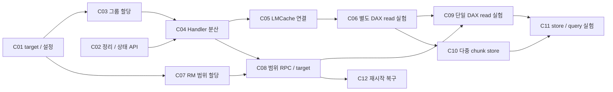

# Maru chunk interleaving 구현 계획

**필수 호환성 조건:** interleaving 설정을 명시적으로 켜지 않으면 기존 동작을 유지한다. 옵션 생략과 명시적 OFF는 동일하게 처리하며, 후속 커밋도 기존 할당·확장·전송·KV 접근 경로를 변경하지 않는다. 이 조건을 깨는 변경은 회귀 테스트로 차단한다.

## 현재 설정 요약 — C01 / Experimental

**C01은 구현·커밋·푸시 완료(`e60ef47`)다. 현재는 설정/검증 단계이며, 실제 분산 할당과 병렬 전송은 아직 미구현이다. 기본값은 OFF이고 ON 실행은 차단된다.**

| 설정 위치 | OFF — 기본값 | ON — 아직 실행 미지원 |
|---|---|---|
| MaruServer CLI | `--allocation-policy fill_first` | `--allocation-policy chunk_round_robin` |
| Python MaruServer | `allocation_policy="fill_first"` | `allocation_policy="chunk_round_robin"` |
| Python MaruConfig | `placement_policy="fill_first"` | `placement_policy="chunk_round_robin", auto_expand=False` |

범위 옵션은 `--target-sizes` 또는 `--target-size + --target-count`, 그리고 `--target-base-offset`이다. 기본은 모두 미지정이며, OFF와 범위 설정을 섞으면 오류다. 신규 LMCache YAML 전달은 아직 구현하지 않았다.

```bash
# 지금 사용 가능한 기존 경로: 옵션을 생략해도 OFF
maru-server --allocation-policy fill_first --dax-path /dev/dax0.0
```

**OFF는 기존 region 요청, page 할당, 자동 확장 기본값, GPU 전송과 KV read/write 경로를 유지한다.** 기존 DAX 상대 경로·alias와 fallback 순서도 그대로 전달하도록 회귀 테스트한다. 새 범위 옵션의 충돌 검사는 별도이며, 전체 환경에서 성능 변화가 0이라고 단정하는 것은 아니다.

실제 추가된 설정 전체, Python 사용법, ON 오류의 의미와 범위 parser 예시는 [디자인 문서 맨 위의 설정 사용법](maru_multi_device_chunk_interleaving_design.md)을 참고한다. C02의 준비·정리 API도 구현됐으며, 아래 C03 이후 항목은 앞으로 진행할 계획이다.

> 상태: C01–C02 구현 완료. C03–C12는 구현 예정이며, ON 실행은 아직 미지원.
> 기반: [다중 CXL 장치 chunk 분산 디자인](maru_multi_device_chunk_interleaving_design.md).
> 원칙: 기본 OFF, 기존 handle 및 KV 위치 형식 유지, 각 기능 커밋에 해당 테스트 포함, 본문 hard wrapping 금지.

## 1. 구현 순서

**별도 DAX 두 개의 공유 read를 먼저 완성하고, 단일 DAX 범위 지정과 병렬 store를 차례로 추가한다.** 읽기 실험은 쓰기를 기존 batch=1로 수행해도 가능하므로 D2H 변경을 기다릴 필요가 없다.

| 순서 | 저장소 | 제안 commit subject | 완료 후 가능한 일 |
|---|---|---|---|
| C01 | Maru | `feat(config): define allocation targets and placement policies` | target 모델과 ON/OFF 설정 검증 |
| C02 | Maru | `refactor(memory): add region cleanup and mapping status APIs` | 그룹 준비 실패를 안전하게 정리하고 pin 상태 관측 |
| C03 | Maru | `feat(server): allocate region groups across DAX targets` | 서버가 별도 DAX별 region 그룹을 확보·반납 |
| C04 | Maru | `feat(handler): allocate chunks round robin across targets` | 두 Handler가 분산 저장 및 공유 read 수행 |
| C05 | LMCache | `feat(maru): wire placement policy into cache allocation` | 실제 통합 경로에서 신규 Handler 정책과 retrieve batch 사용 |
| C06 | LMCache | `bench(maru): compare single-target and striped query reads` | 별도 DAX 두 개의 읽기 대역폭 비교 |
| C07 | Maru | `feat(rm): allocate extents within explicit DAX ranges` | RM 내부에서 단일 DAX 주소 범위 제한 할당 |
| C08 | Maru | `feat(rpc): expose bounded DAX allocation targets` | 단일 DAX에서도 동일한 Handler 분산 정책 사용 |
| C09 | LMCache | `bench(maru): cover shared reads across single-DAX targets` | 단일 DAX 범위 모드의 정확성·성능 비교 |
| C10 | LMCache | `feat(transfer): support validated multi-chunk Maru stores` | 검증된 2/4-chunk D2H 전송 |
| C11 | LMCache | `bench(maru): measure multi-target store and query latency` | 읽기·쓰기 및 전체 query 지연 비교 |
| C12 | Maru | `feat(server): reconcile allocation groups after restart` | 재시작을 포함한 그룹 회수·재시도 보장; PoC 이후 단계 |

위 번호는 의존성을 설명하는 식별자다. Maru와 LMCache는 별도 저장소이므로 하나의 git commit에 양쪽 수정을 섞지 않는다. 각 커밋은 아래 테스트가 통과하는 상태로 만들며, 다른 저장소의 특정 버전이 필요하면 PR과 benchmark manifest에 그 revision을 기록한다.



**첫 번째 실험 가능 지점은 C06**, **단일 DAX switch pool 실험 가능 지점은 C09**, **병렬 store까지 비교 가능한 지점은 C11**이다. C12는 PoC 결과 확인 후의 운영 안정화 작업이며, 그 전까지 재시작 복구를 지원한다고 주장하지 않는다.

## 2. 코딩 전 확인할 사항

이 단계는 코드 변경을 위한 확인 작업이다. 조사만으로 빈 git commit을 만들지 않는다. 확인한 사실은 관련 기능 커밋의 설명과 실험 manifest에 남긴다.

1. 실제 실험 환경의 Maru/LMCache revision, import되는 Maru package 위치, vLLM→MP 서버→Handler→GPU 전송 호출 경로를 기록한다.
2. 현재 확인한 LMCache 트리에서 직접적인 `MaruConfig` 생성은 `lmcache/v1/storage_backend/maru_backend.py`에 있다. MP의 별도 integration이 배포 branch나 외부 plugin에 있다면 C05의 정확한 수정 파일을 그 코드에서 확정한다. 디자인 문서의 과거 MP 파일 이름을 현재 구현으로 가정하지 않는다.
3. MP에서 Maru 객체를 직접 전송하는 경로가 없는 경우, 기존의 실제 Maru connector로 먼저 검증할지 또는 MP 통합 선행 작업이 필요한지 기록한다. 전체 MP Maru 포팅을 C05의 설정 변경 안에 숨기지 말고 별도 선행 커밋으로 분리한다.
4. `lmcache_driven_transfer.py`의 store `batch_size=1` 제약은 코드 이력과 descriptor/buffer 수명으로 근거를 확인한다. 이 조사는 C10 전에 완료하되 C01–C09를 막지 않는다.
5. 실제 backing, 공유 upstream, GPU/NUMA 위치, DAX alignment와 header 예약 공간을 확인한다. 제품 용량이나 DAX 개수만으로 target 경계를 정하지 않는다.
6. 먼저 테스트용 파일 기반 RM fixture와 CPU unit test 환경을 준비한다. 실제 GPU/CXL 검증이 필요한 항목은 별도 표시하며, mock 통과를 하드웨어 성능 검증으로 대체하지 않는다.

LMCache 새 branch/PR은 저장소 지침에 따라 `dev`를 기준으로 한다. Maru는 구현 시 해당 저장소의 기본 branch와 지침을 확인한다. 기존 사용자의 미추적 문서와 다른 작업은 해당 커밋에 포함하지 않는다.

## 3. 모든 커밋에 적용할 계약

- **기본 OFF:** `allocation_policy=fill_first`, `placement_policy=fill_first`. 생략과 명시적 OFF의 동작은 같다.
- **ON:** 두 정책 모두 `chunk_round_robin`. 설정 충돌이나 미지원 capability는 초기화 실패로 처리한다.
- **범위 설정:** OFF와 `allocation_targets`/`target-sizes`를 함께 주면 오류다. 범위를 무시하고 전체 DAX를 할당하지 않는다.
- **식별자:** 상위 정책에는 `target_id`, RM의 실제 DAX에는 기존 물리 `poolId`를 쓴다. 디자인 §4의 초기 `pool_id` 표기는 §3.4에서 일반화한 `target_id`로 구현한다.
- **용량:** ON에서 `pool_size`는 target 전체의 초기 목표량이다. 실제 예약량과 usable capacity를 구분한다.
- **수명:** 쓰기 완료 전 KV 공개 금지, 읽기/쓰기 완료 전 source·destination page와 mapping 해제 금지.
- **키/주소:** 기존 KV key, `MaruHandle`, `(region_id, offset, length)`, adapter page 주소 형식은 유지한다.
- **초기 실험:** 자동 확장 OFF, 동일 성능 target 두 개, sequential query/full hit. ON과 `auto_expand=True`는 그룹 확장 구현 전 명확히 거부하며 단일 target로 조용히 확장하지 않는다.
- **변경 범위:** 하드웨어 decoder나 NUMA 구성을 이 옵션으로 변경하지 않는다. target 설정은 재시작으로 적용하며 기존 KV를 재배치하지 않는다.
- **코드 규율:** 새 public API에는 타입·docstring·행동 테스트를 추가한다. 다른 클래스의 private 상태를 직접 수정하지 않는다.

## 4. 커밋별 상세 계획

### C01 — target 모델과 ON/OFF 설정

**목적:** 별도 DAX와 단일 DAX 범위를 같은 데이터 모델로 표현하고, 실제 할당을 바꾸기 전에 설정 계약을 확정한다.

**수정 지점:** `maru_common/config.py`, 서버 설정을 파싱하는 현재 진입점, 신규 target 정의 모듈(예: `maru_common/allocation_target.py`; 제안 경로).

- `AllocationTarget`에 `target_id`, DAX 경로, 선택적 offset/length를 정의한다. device UUID는 서버가 검증한 실제 장치 정보와 연결한다.
- 기존 전체 DAX 목록은 whole-device target 목록으로 정규화한다. 범위 target은 offset/length를 명시한다.
- `target-sizes`, `target-size + target-count`를 명시적 범위로 펼치는 parser를 추가한다. GiB 단위, base offset, 누적합 overflow, 음수/0, 중복 ID, 동일 장치의 범위 겹침을 검사한다.
- 장치 실제 크기와 alignment 검증은 조회 후 수행한다. header만큼 모든 범위의 시작점을 이동시키지 않는다.
- 정책 기본값, OFF+범위 설정 오류, 전체 DAX 목록과 명시적 target 목록 동시 지정 오류를 검사한다.
- 이 커밋에서는 ON을 지원한다고 advertise하지 않는다. 아직 구현되지 않은 실행 경로는 명확히 거부한다.

**테스트:** 새 target/config public API 테스트. `[256 GiB, 256 GiB]`가 `[0,256 GiB)`, `[256,512 GiB)`로 변환되고 OFF의 기존 설정이 그대로 통과해야 한다.

**완료 조건:** C03/C08이 동일한 정규화된 target 모델을 사용할 수 있고 legacy 실행에는 동작 변화가 없다.

### C02 — region별 정리와 mapping 상태 조회

**목적:** 여러 region을 준비하다가 실패해도 이번 준비 작업만 정리할 수 있는 public API를 먼저 만든다.

**수정 지점:** `maru_handler/memory/mapper.py`, `owned_region_manager.py`, `maru_handler/handler.py`, `maru_lmcache/adapter.py`.

- region별 owned allocator 제거, adapter의 사전 생성 tensor/view 제거, mapping/pin 상태 조회 API를 정의한다.
- 해제 순서는 adapter view → allocator/region view → CUDA unregister → mmap close → 서버 반납으로 정한다. live allocation 또는 in-flight 참조가 있는 region은 제거를 거부한다.
- 준비 중인 region을 일반 alloc 대상으로 노출하지 않는 staged 준비 경로를 만든다. 기존 add-region callback의 초기 replay와 후속 추가 동작을 유지한다.
- API 이름과 호출 순서는 이 커밋에서 고정한다. C04에서 private dict를 직접 지우는 우회 구현을 만들지 않는다.
- pin 실패가 항상 모든 기존 사용자의 초기화 실패가 되도록 바꾸지 않는다. 신규 GPU 실험 모드에서 요구하는 검증과 기존 정책을 구분한다.

**테스트:** `tests/unit/test_owned_region_manager.py`, `test_maru_handler.py`, `test_cxl_memory_adapter.py`를 확장한다. 두 번째 region 준비나 callback이 실패해도 첫 번째 신규 region이 정리되고 기존 region은 남아야 한다. 반복 cleanup과 제거 거부도 테스트한다.

**완료 조건:** C04에서 그룹 준비 전체를 rollback할 수 있고 benchmark가 public API로 pin 성공 여부를 확인할 수 있다.

#### C02 구현 결과와 API 계약

**구현 완료. 신규 config는 없으며, 기존 OFF의 connect/확장/전송은 staged API를 호출하지 않는다.** 이 단계는 그룹 준비를 위한 기반 API만 제공한다. C03의 서버 그룹 RPC와 C04의 ON 연결·분산 할당은 아직 구현하지 않았다.

| Public API | 계약 |
|---|---|
| `OwnedRegionManager.stage_region(handle)` | mmap/allocator를 준비하되 일반 할당·용량 통계·기존 region 조회에 공개하지 않음 |
| `OwnedRegionManager.commit_regions(ids)` | 전체 ID를 검증한 뒤 지정 순서로 allocator에 공개 |
| `OwnedRegionManager.remove_region(id)` | allocator만 제거; live page 또는 명시적 사용 참조가 있으면 거부; 없는 ID는 no-op |
| `MaruHandler.prepare_regions(handles, require_cuda_pin=False)` | 새 서버 handle의 준비를 인수하고 callback까지 실행; 아직 alloc 대상으로 공개하지 않음 |
| `MaruHandler.commit_regions(ids)` | 준비 성공한 region을 공개; 기존 fill-first 순서를 유지하며 RR은 C04 대상 |
| `MaruHandler.rollback_regions(ids)` | 이번 준비의 region만 역순으로 정리·반납; 기존 active region은 거부 |
| `MaruHandler.get_staged_region_ids()` | 아직 준비 중이거나 cleanup/반납 재시도가 필요한 ID 조회 |
| `MaruHandler.set_on_region_removed(callback)` | region별 adapter view 정리 callback 등록; 기존 add callback의 초기 replay/확장 호출은 유지 |
| `MaruHandler.get_mapping_status(id)` | 불변 snapshot: `is_mapped`, 실제 pin 성공 여부 `cuda_pinned`, 명시적 lease 수 `active_users` |
| `MaruHandler.hold_region(id)` | context 종료까지 staged rollback 방지; GPU 비동기 작업은 launch가 아니라 완료까지 유지해야 함 |
| `CxlMemoryAdapter.has_region_pool(id)` / `remove_region_pool(id)` | pool 존재 조회와 region별 tensor/view 제거; 사용 중인 region 제거 거부 |
| `DaxMapper.release_region(id)` | 엄격한 CUDA unregister → mmap close; 실패를 숨기지 않고 재시도 상태 유지 |

`prepare_regions`의 입력 중복·기존 region·callback 짝 검증이 실패하면 handle 소유권은 호출자에게 남는다. 검증 후 준비를 인수한 경우에는 두 번째 region에서 실패해도 아직 시도하지 않은 handle까지 포함해 이번 입력 전체를 정리한다. add callback이 있으면 remove callback도 필요하며, callback 안에서는 lifecycle API 재진입이나 page 할당을 하지 않는다. callback에서 조회해야 하는 staged 여부는 `is_region_staged(id)`를 사용한다.

```python
# 향후 C03/C04 호출부 예시: handles는 이번 instance가 새로 받은 서버 allocations.
# 기존 connected Handler에서도 API 자체를 검증할 수 있지만 OFF 연결이 자동 호출하지는 않는다.
region_ids = handler.prepare_regions(handles, require_cuda_pin=True)
try:
    for region_id in region_ids:
        status = handler.get_mapping_status(region_id)
        assert status.is_mapped and status.cuda_pinned
    handler.commit_regions(region_ids)
except Exception:
    handler.rollback_regions(region_ids)
    raise
```

정리 순서는 **adapter tensor/view → owned allocator → CUDA unregister → mmap close → 서버 return_alloc**이다. 외부 memoryview/tensor가 남아 mmap close가 실패하거나 CUDA unregister/서버 반납이 실패하면 그 ID를 pending으로 유지한다. 다른 신규 region의 정리는 계속하며, 실패는 `ExceptionGroup`으로 보고한다. 남은 참조를 해제한 뒤 `rollback_regions(handler.get_staged_region_ids())`로 재시도할 수 있다. 반납 RPC의 응답 유실에 대한 서버 측 중복 억제와 재시작 복구는 각각 C03/C12 범위다.

**lease는 기존 GPU 작업을 자동 감지하는 장치가 아니다.** 새 경로에서 비동기 작업을 실행하는 호출자가 완료까지 명시적으로 유지해야 한다. 기존 close/unmap의 수명 계약은 바꾸지 않는다. 다만 staged region이 남은 상태에서 Handler `close()`를 호출하면 먼저 rollback하며, 이것이 실패하면 기존 연결과 active region을 유지하고 오류를 반환한다. 성공한 cleanup의 반복 호출은 no-op이다.

**검증:** CPU 기본 환경의 CI 대상 테스트 837 passed / 4 skipped, 실제 PyTorch·LMCache를 import한 CPU adapter/Handler/mapper/allocator 테스트 218 passed. 기본값과 명시적 `fill_first`에서 connect → region 확장 → close가 staged 경로를 호출하지 않는 회귀 테스트를 포함한다. pin 성공/실패 및 unregister 실패는 CUDA mock으로 검증했고 실제 GPU/CXL 성능은 측정하지 않았다.


### C03 — MaruServer의 그룹 할당 RPC

**목적:** 기존 RM API를 사용하여 별도 DAX마다 region 하나씩 확보하고 그룹 결과를 반환한다.

**수정 지점:** `maru_common/protocol.py`, `serializer.py`, `maru_handler/rpc_client_base.py`, sync/async transport 연결, `maru_server/server.py`, `rpc_handler_mixin.py`, `allocation_manager.py`.

- 그룹 요청은 instance ID, request ID, 총 크기, chunk 크기를 받는다. 응답은 target별 handle 및 확인된 target 정보, 실제 reserved/usable bytes를 포함한다.
- 서버 허용 target만 선택하고 디자인의 LCM 정렬 규칙으로 총량을 분할한다. 최소 한 page/정렬 단위를 각 target에 제공할 수 없으면 거부한다.
- 기존 `MaruShmClient.alloc(size, dax_path)`를 target별로 호출한다. 범위 target은 C08까지 명확히 미지원으로 처리한다.
- 중간 실패 시 이번 그룹에서 확보한 region만 보상 해제한다. 실패한 rollback은 누락하지 않고 request ID와 미회수 region을 추적한다.
- 동일 프로세스 수명 안에서 `(instance_id, request_id)`별 결과를 재사용한다. 같은 ID에 다른 payload를 보내면 오류이며, concurrent 중복 요청도 추가 할당을 만들지 않는다.
- release 이후 같은 ID를 재사용했을 때 이미 해제된 handle을 성공 반환하지 않도록 terminal 상태를 남긴다. 캐시 보관·정리 정책도 명시한다.
- 연결 해제/그룹 반납 경로와 request 결과 추적을 함께 연결한다. reply 유실과 RM timeout은 별도로 구분하고 알 수 없는 결과를 성공으로 추정하지 않는다.
- 완성된 endpoint만 `multi_pool_alloc_v1` capability로 advertise한다. 구버전 메시지의 binary/MessagePack 계약을 변경하지 않는다.

**테스트:** `test_protocol.py`, `test_serializer.py`, `test_rpc_client.py`, `test_rpc_async_client.py`, `test_rpc_handler_mixin.py`, `test_allocation_manager.py` 및 sync/async integration. 두 번째 target 실패, duplicate request, payload 불일치, reply 유실 후 같은 ID 재조회, 타인의 region 반납 거부를 포함한다.

**완료 조건:** 별도 DAX 그룹 요청이 전체 성공 또는 추적 가능한 실패로 끝나며, 단일 region 요청은 기존과 동일하게 동작한다.

**한계:** 이 커밋의 재시도 보장은 서버가 살아 있는 동안의 그룹 중복 억제다. 서버/RM 재시작과 할당 직후 crash의 완전한 회수는 C12 대상이다.

### C04 — Handler 그룹 연결과 target별 round-robin

**목적:** C03으로 확보한 region들을 한 Handler의 초기 영역으로 준비하고 chunk를 target별로 분산한다.

**수정 지점:** `maru_handler/handler.py`, `memory/owned_region_manager.py`, `memory/types.py`, `maru_lmcache/adapter.py`.

- ON이면 capability 확인 후 그룹 요청, OFF이면 기존 단일 region 요청을 사용한다.
- 전 region의 mmap/요구되는 pin/allocator 준비 후에만 연결 성공으로 전환한다. 오류 경로는 C02의 public 정리 API로 그룹 전체를 정리하고 C03으로 반납한다.
- `regions_by_target`과 cursor를 유지한다. target에 region이 두 개 있다고 그 target을 두 번 선택하지 않는다.
- allocator는 기존처럼 가용 target을 탐색할 수 있으나 target 고갈로 균등성이 깨진 경우를 public 상태에 표시한다. strict benchmark는 이를 감지해 run을 실패 처리한다. 자동 확장/성능 저하를 숨기지 않는다.
- batch 할당 결과는 입력 chunk 순서로 반환한다. 중간 실패 시 page만 원래 region에 돌려주며 cursor를 과거로 복원할 필요는 없다.
- shared lookup은 writer region handle을 사용한다. reader-owned region에 재복사하거나 reader cursor로 위치를 추측하지 않는다.

**테스트:** H1/H2 각각 총 512 MiB와 32 MiB page를 사용한 디자인 예제를 fixture로 구현한다. H1의 8개 chunk가 A/B에 4개씩 배치되고 H2가 같은 bytes를 읽으며, H2의 owned free page 수가 read 전후 동일해야 한다. GPU 없이 파일-backed mapping으로 데이터·소유권 계약을 먼저 검증한다.

**완료 조건:** 기본 OFF 회귀 테스트와 두 Handler 공유 read가 통과한다. H2가 H1의 region을 shared로 매핑해도 RM 예약량과 저장 payload가 증가하지 않는다.

### C05 — LMCache 정책 전달과 실제 read 연결

**목적:** Maru 단독 테스트에서 끝나지 않도록 vLLM/LMCache의 실제 객체·전송 경로까지 연결한다.

**수정 지점:** 확인된 `lmcache/v1/config.py`, `storage_backend/maru_backend.py` 및 실행 중인 MP Maru integration의 설정 생성 지점. MP 전송을 사용하는 경우 `multiprocess/modules/lmcache_driven_transfer.py`와 CUDA cache context의 batch 계약도 확인한다.

- C01 정책을 MaruConfig까지 전달하고 실제 object layout에서 page 크기를 계산한다. MP의 object group별 크기가 다른 경우 현재 Maru 계약과의 호환성을 먼저 확인한다.
- OFF에서는 기존 설정/실행 경로를 유지한다. ON인데 설치된 Maru가 지원하지 않으면 시작 단계에서 설명 가능한 오류를 낸다.
- retrieve batch를 1/2/4로 선택하는 실험 경로를 제공한다. 현재 네이티브 한계 4를 넘는 값은 거부한다.
- source pointer와 engine block 목적지를 원래 chunk 순서로 유지한다. chunk를 단순히 target별로 정렬하지 않는다.
- benchmark에 필요한 target별 placement와 pin 상태를 public 경로로 노출한다. handle auth token은 로그나 manifest에 기록하지 않는다.

**테스트:** `tests/v1/storage_backend/test_maru_backend.py`, 실제 MP integration 테스트, `tests/v1/test_mp_mem_kernels.py` 및 prefix/partial 관련 테스트. 고유한 byte 패턴을 서로 다른 source buffer에 넣고 batch=1/2/4로 GPU 목적지에 정확히 복원되는지 확인한다.

**완료 조건:** 실제 실행 경로에서 분산된 writer MemoryObj가 만들어지고 reader가 같은 위치를 사용한다. legacy OFF는 기존 Maru 버전과도 호환되며 신규 기능만 최소 지원 버전을 요구한다.

### C06 — 별도 DAX read benchmark

**목적:** CXL 장치 추가 효과와 batch 자체의 효과를 구분하는 재현 가능한 runner를 만든다.

**수정 지점:** 실행에 사용하는 기존 Maru benchmark runner를 확장하거나 `benchmarks/maru_interleaving/`를 새로 만든다(제안 경로). 하나의 runner에 workload 생성, 정확성 확인, 측정, manifest 출력을 묶는다.

- 동일 query/chunk 수와 총 usable capacity로 single target batch=1, single target batch=2/4, 두 target RR batch=1, 두 target RR batch=2/4를 실행한다.
- writer store는 검증된 기존 batch=1을 사용한다. read 속도를 측정하기 위해 병렬 store를 먼저 만들지 않는다.
- H1 store 완료·등록 성공 뒤 H2가 full hit를 확인하고 읽는다. mapping/pin warm-up과 정상상태 측정을 분리한다.
- GPU 완료를 포함한 전송 시간, 실제 payload bytes, target별 chunk 수, cache hit, TTFT를 분리 기록한다.
- topology, 실제 패키지와 양쪽 revision, policy, batch, UUID/target 범위, pin 성공을 manifest에 기록한다.
- 최소 5회 반복하고 case 순서를 교차한다. target별 counter가 없으면 그 한계를 결과에 표시한다.

**테스트:** runner의 dry-run/설정 검증 및 synthetic 결과 집계 테스트. 실제 CXL 2개와 GPU를 이용한 correctness+performance 실행은 별도 하드웨어 gate다.

**완료 조건:** 디자인 예제의 8-chunk query를 H1이 저장하고 H2가 읽는 실험을 재현할 수 있다. 단일 장치 batch 최적화와 비교해도 추가 이득이 있는지 판단할 수 있다.

### C07 — RM C++ 범위 제한 allocator

**목적:** 단일 DAX의 임의 target 범위에서 region을 안전하게 확보하는 allocator 기능을 만든다.

**수정 지점:** `maru_resource_manager/src/pool_manager.h`, `pool_manager.cpp`, C++ 테스트와 `CMakeLists.txt`.

- 기존 public 할당 API를 유지하면서 범위 제한 public 진입점을 추가한다.
- 동일 물리 pool의 free-list와 mutex를 공유하고 `free extent ∩ target range` 안에서 정렬된 region을 선택한다.
- overflow, 파일 용량 초과, header 예약 범위, 정렬 및 공간 부족을 검사한다. region이 target 경계를 넘으면 실패해야 한다.
- free/coalesce는 기존 물리 pool에 수행한다. target 경계를 넘어 합쳐진 free extent도 다음 bounded allocation에서 다시 잘라 선택한다.
- 기존 allocation/WAL에 저장되는 물리 offset/length를 재사용하고 replay 후에도 겹침이 없는지 검증한다.
- target별 free bytes 및 최대 연속 할당 가능 크기를 계산하는 public 관측 API를 제공한다.

**테스트:** 신규 `maru_resource_manager/tests/test_pool_manager_ranges.cpp`(제안). 기존 UUID/header fixture 방식을 재사용한다. 한 파일에 두 범위, header 직후 할당, 경계 직전 실패, fragmentation, legacy 요청과의 중복 방지, concurrent 요청, free/coalesce, replay 후 재할당을 검사한다.

**완료 조건:** 실제 DAX 없이 allocator의 범위·수명 계약을 검증한다. 이 커밋에서는 Python/RPC에서 범위 기능을 advertise하지 않아도 된다.

### C08 — 범위 제한 wire protocol과 서버 연결

**목적:** C07을 Python 클라이언트와 그룹 할당에 연결하여 같은 DAX의 두 target을 실제로 선택한다.

**수정 지점:** `maru_resource_manager/include/ipc.h`, `ipc_serialize.h`, `src/request_handler.*`, `tcp_server.cpp`, `maru_shm/ipc.py`, `client.py`, 서버 target 해석과 capability 처리.

- 기존 `ALLOC_REQ` 바이트 형식을 바꾸지 않고 별도 지원 협상/메시지로 bounded allocation을 추가한다. 미지원 RM에 범위 없는 요청으로 fallback하지 않는다.
- C++와 Python 간 요청/응답 직렬화 golden fixture를 맞춘다. offset/length와 전체 메시지 길이의 잘림·overflow를 검사한다.
- `alloc_in_range`를 public API로 노출하고 request ID/중복 억제에 범위와 size를 함께 반영한다.
- target-sizes/명시적 범위를 실제 UUID·용량·alignment로 검증한다. 같은 UUID라는 이유로 서로 다른 target을 합치지 않는다.
- C03 그룹 할당에서 전체 DAX target은 기존 API, 범위 target은 bounded API를 선택한다. 응답 target ID와 원래 파일 기준 handle.offset을 유지한다.
- Python client path cache/access 조회와 RM accounting이 서로 다른 두 offset을 정확히 추적하는지 확인한다.

**테스트:** C++/Python 직렬화 호환성, 구버전 RM 거부, 단일 파일 두 범위 그룹 요청, 두 Handler의 non-overlap, 한 target만 고갈된 실패의 rollback. 기존 단일 DAX 무범위 API의 회귀도 확인한다.

**완료 조건:** 같은 DAX 하나를 사용해도 H1/H2가 A/B 범위에 서로 겹치지 않는 region을 받고 C04의 공통 allocator를 사용할 수 있다.

### C09 — 단일 DAX 공유 read 실험

**목적:** C06 runner로 switch pool의 범위 지정 모드를 검증한다.

**수정 지점:** C06의 benchmark runner와 설정 예시. allocator나 GPU 커널 변경을 섞지 않는다.

- 명시적 offset/length와 크기 목록을 runner에 연결하고 전개된 target 범위를 manifest에 저장한다.
- 같은 DAX의 target A만 사용하는 기준군, A/B에 분산하지만 batch=1인 case, A/B+batch=2/4 case를 비교한다.
- single-DAX H1/H2 예제에서 파일 offset 계산과 GPU 복원 데이터를 확인한다. header 보존과 reader-owned 영역 미사용도 검증한다.
- 이미 하드웨어 interleave된 영역에서는 OFF 기준으로 실행한다. ON 결과를 추가 물리 장치 수에 의한 성능 향상으로 해석하지 않는다.
- 실제 backing을 확인할 수 없는 환경에서는 논리 분할 기능 테스트와 물리 bandwidth 결론을 구분한다.

**완료 조건:** C08의 기능 정확성과 실제 장치별 대역폭 효과를 별도로 보고할 수 있다. target별 capacity가 달라졌다면 usable capacity를 맞춘 뒤 비교한다.

### C10 — 다중 chunk store의 완료 계약과 구현

**목적:** 현재 store batch=1 제약을 안전하게 해소한다.

**수정 지점:** 실제 MP store 경로, descriptor/임시 버퍼 준비, `csrc/cuda/mp_mem_kernels.cu` 및 관련 타입. 조사 결과 커널이 이미 안전하게 지원하면 불필요한 커널 변경 없이 호출부 계약만 수정한다.

- 커밋 설명에 기존 batch=1 제약의 근거와 해소 방법을 기록한다.
- batch=2/4에 필요한 source/destination descriptor와 임시 메모리 수명을 보장한다.
- prefix/partial/None 객체, object group별 layout, 원래 engine block mapping을 처리한다.
- 전체 해당 전송 완료 뒤에만 `finish_write`를 실행한다. launch 실패 또는 일부 전송 실패 시 공개·해제 규약을 명시한다.
- 초기 구현은 기존 단일 stream의 다중 객체 커널을 우선한다. stream 추가는 필요성이 측정된 경우 별도 후속 커밋으로 분리한다.
- 검증 완료 전 기본 store 동작을 바꾸지 않는다. 신규 옵션은 명시적 opt-in이며 1/2/4만 허용한다.

**테스트:** batch=1/2/4의 bitwise 왕복, 부분 chunk/prefix skip/None, descriptor 재사용, 중간 실패, 완료 전 reader lookup과 page 재사용 방지. 기존 skip/layout 테스트와 CUDA cache-context 테스트를 함께 확인한다.

**완료 조건:** 정확성·수명 테스트를 통과한 2/4-chunk store가 동작한다. kernel batch가 커졌다는 사실만으로 bandwidth가 증가했다고 결론 내리지 않는다.

**분할 기준:** 제약 조사에서 공용 전송 버퍼의 독립적인 버그를 발견하면 회귀 테스트를 포함한 선행 fix 커밋과 opt-in batching 커밋으로 C10을 나눈다. 여러 stream까지 한 커밋에 묶지 않는다.

### C11 — store 및 query 전체 성능 비교

**목적:** C06/C09 runner에 쓰기 matrix를 추가하여 기능의 최종 효과를 정리한다.

- 별도 DAX와 단일 DAX 범위 모드 각각에서 store batch=1/2/4를 비교한다.
- 단일 target batch=2/4도 포함하여 launch overhead 감소와 장치 대역폭 결합을 분리한다.
- store 성공 bytes, read full-hit, GPU 왕복 정확성, 전송 시간, query TTFT, target별 동시 접근 관측을 함께 기록한다.
- cold start의 mmap/pinning 시간과 정상상태 전송 성능은 별도 표로 제시한다.
- 결과 요약은 raw data 위치·revision·재현 명령과 함께 저장한다. 대용량 trace는 적절한 artifact 저장 위치를 사용하며 모든 원본을 git에 넣지는 않는다.

**완료 조건:** 장치 수만큼 빨라졌는지보다 반복 편차를 넘는 이득이 있는지, 공유 경로 포화가 어디인지, 전체 query 지연으로 이어지는지를 설명할 수 있다.

### C12 — 그룹 재시작 복구와 운영 문서

**목적:** PoC에서 명시적으로 제한한 서버/RM 재시작, 응답 유실, 그룹 준비 중 crash를 운영 수준으로 처리한다.

**수정 지점:** MaruServer 그룹 상태 기록·reconciliation, RM allocation 조회/기존 복구 경로, 관련 integration test와 실제 사용자 문서.

- request ID→그룹 결과 및 해제 상태를 재시작 후에도 대조할 수 있도록 기록한다.
- RM 할당 직후 서버 기록 전 crash를 포함해 orphan 판별에 필요한 최소 public 정보가 있는지 확인한다. 없으면 RM 조회 계약을 별도 작은 선행 커밋으로 추가한다.
- 다른 instance의 살아 있는 region이나 shared KV 참조가 남은 region을 자동 회수하지 않는다.
- target config version/hash 불일치와 기존 handle의 backing 변경을 감지하고 새 할당을 거부한다.
- 재시작을 포함한 ON→OFF 전환, 이전 request ID 재전송, 중복 해제, RPC timeout 후 reconciliation을 테스트한다.
- 이 단계에서 검증된 설정·실험 명령을 사용자 문서에 승격하고, 아직 실험적인 자동 확장/weights와 구분한다.

**완료 조건:** 복구 테스트로 증명한 범위만 운영 지원으로 문서화한다. 이 기능을 생략한 PoC에서는 crash/timeout run을 실패 처리하고 해당 run 소유 allocation의 정리를 확인한다.

## 5. 테스트 명령과 실행 위치

아래는 현재 확인한 경로를 기준으로 한 검증 예시다. 의존성을 설치한 각 저장소 환경에서 실행한다. 새 테스트 파일은 해당 커밋에서 추가한 뒤 목록에 포함한다.

### Maru Python — C01~C04, C08, C12

```bash
cd /home/shson/maru
python -m pytest tests/unit/test_allocator.py tests/unit/test_owned_region_manager.py tests/unit/test_maru_handler.py tests/unit/test_cxl_memory_adapter.py
python -m pytest tests/unit/test_protocol.py tests/unit/test_serializer.py tests/unit/test_rpc_client.py tests/unit/test_rpc_async_client.py tests/unit/test_rpc_handler_mixin.py tests/unit/test_allocation_manager.py
```

시스템에 `python` 명령이 없으면 활성화한 환경의 interpreter 또는 `python3`를 사용한다. fixture가 필요한 integration test는 실제 test server/RM 준비 조건을 먼저 읽고 실행한다.

### Maru RM C++ — C07~C08

```bash
cd /home/shson/maru
cmake -S maru_resource_manager -B /tmp/maru-interleaving-rm-build -DMARU_BUILD_TESTS=ON
cmake --build /tmp/maru-interleaving-rm-build
ctest --test-dir /tmp/maru-interleaving-rm-build --output-on-failure
```

현재 CMake는 `MARU_BUILD_TESTS` 옵션과 `maru_rm_tests`를 제공한다. C07에서 신규 range 테스트를 이 target에 등록한다. 환경에 따라 GTest 준비가 필요하며 실제 DAX를 요구하지 않는 테스트와 하드웨어 integration을 분리한다.

### LMCache — C05, C10 및 benchmark 검증

```bash
cd /home/shson/LMCache
python -m pytest tests/v1/storage_backend/test_maru_backend.py
python -m pytest tests/v1/test_mp_mem_kernels.py tests/v1/platform/test_gpu_cache_context.py tests/v1/multiprocess/test_lmcache_driven_transfer_skip.py
```

GPU/네이티브 extension이 필요한 테스트는 해당 환경에서 실행한다. 실행되지 않고 skip된 경우 통과한 GPU 검증으로 보고하지 않는다. 각 저장소의 lint와 필수 CI는 기능 커밋과 PR 단계에서 수행한다. LMCache의 전체 pre-commit은 Rust 도구 가용성을 확인하고, 비-Rust 변경만 검증할 때는 저장소 지침의 명시적 skip 방식을 사용한다.

## 6. PR 묶음과 배포 호환성

| PR 단위 | 포함 커밋 | 리뷰 주제 |
|---|---|---|
| Maru A | C01–C04 | 기본 OFF, target abstraction, 그룹 수명, chunk 분산 |
| LMCache A | C05–C06 | 실제 integration 연결과 읽기 가설 검증 |
| Maru B | C07–C08 | 단일 DAX 범위 할당 및 protocol 호환성 |
| LMCache B | C09 | 범위 모드 읽기 실험 |
| LMCache C | C10–C11 | D2H 정확성·완료 계약과 성능 |
| Maru C | C12 | 재시작 복구와 운영 계약 |

프로토콜 추가는 capability로 협상한다. 기존 RM/서버/Handler와의 OFF 경로는 유지하고, ON에 필요한 기능이 없으면 연결/할당 전에 거부한다. 설치 순서는 필요한 RM → MaruServer → Maru client/LMCache 순서로 검증하되, 실제 호환성은 capability와 테스트 결과로 판단한다. hardware-interleaved pool의 기본 운영 설정은 OFF다.

각 PR 설명에는 해결한 구체적 문제, 최종 동작, 해당 커밋의 테스트 결과, 필요한 상대 저장소 revision을 적는다. 신규 코드가 활성화되는 순간 관련 기능 테스트도 함께 있어야 하며, 테스트를 마지막 커밋에 몰지 않는다.

## 7. 첫 구현에서 제외하고 후속 커밋으로 남길 항목

| 후속 작업 | 제안 subject | 시작 조건 |
|---|---|---|
| target 그룹 자동 확장 | `feat(handler): expand allocation groups across targets` | C04/C08 수명 계약 검증 및 고갈 시 동작 필요 확인 |
| 가중치 분산 | `feat(allocator): support weighted target placement` | 장치별 read/write 성능 비대칭 측정 |
| 여러 query의 batch별 균형 | `feat(allocator): balance targets within allocation batches` | 전역 RR이 per-query 분산을 깨는 실제 workload 확인 |
| 여러 stream / 커널 block 배치 | `perf(transfer): increase concurrent target accesses` | batch=2/4에서 동시 접근 부족이 병목임을 확인 |
| 4개 초과 객체 batch | `feat(transfer): extend native object batch capacity` | 4개 장치/batch 한계를 넘어야 할 실험 근거 확보 |

자동 확장은 `expand_size`를 그룹 전체 증가량으로 정의하고 기존 region을 유지한 채 새 그룹을 준비해야 한다. 가중치·multi-stream·batch 확대는 성능 측정 없이 첫 구현에 함께 넣지 않는다.

## 8. 구현 완료 체크리스트

- [ ] C04: H1이 분산 저장한 8개 chunk를 H2가 같은 region에서 정확하게 읽는다.
- [ ] C06: 별도 DAX에서 단일 target batch 최적화와 분산 효과를 분리 측정한다.
- [ ] C08: 단일 DAX의 지정 범위를 벗어나거나 header를 덮는 할당이 없다.
- [ ] C09: 실제 backing을 확인한 단일 DAX target에서도 공유 read와 성능 비교가 가능하다.
- [ ] C10: 다중 chunk store가 완료 전 KV를 공개하거나 page를 재사용하지 않는다.
- [ ] C11: 실제 payload·cache hit·총 용량을 맞춘 read/write/query 결과가 있다.
- [ ] 모든 단계: OFF가 기존 동작을 유지하고, 미지원 ON이나 잘못된 범위 설정은 명확히 실패한다.
- [ ] C12 수행 전: PoC의 crash/재시작 복구 한계를 명시한다. C12 수행 후에는 실제 fault-injection 결과를 남긴다.

첫 실행 목표는 **C01–C06을 완료하여 별도 DAX 두 개의 read 결과를 얻는 것**이다. 그 결과와 별개로 단일 DAX switch pool을 지원해야 하면 C07–C09를 진행하며, 병렬 store는 C10–C11에서 독립적으로 검증한다.
